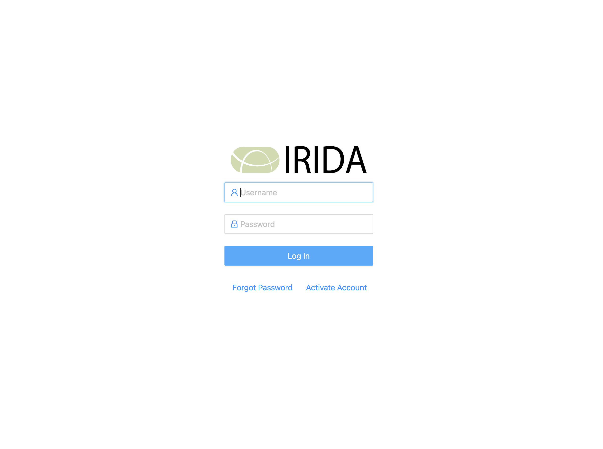

# Overview: 
VIGAS/P stands for Veteriary Institute Genome Analysis System/Platform. VIGASP uses IRIDA for data management, data access control, analysis and storing the results. IRIDA uses Galaxy to execute the pipelines. 
### Features of VIGASP:
1. Browser based user friendly platform accessible from VI PC/Laptop or using VI VPN.
2. All data (fastq files, genome assemblies and metadata) and results are stored in an organized (Genus, sample_id and project) way with proper data access control.
3. Possible to search by genus, sample_id, file_name and results (F. ex. MLST type, seroptype, amr genes, etc,.)
4. As of March 2024, we have 11 pipelines
5. Each project/Genus can set automated pipelines every time when there is a new data with specific parameters for that Genus
6. Formatted results are stored in a table format along with samples (LineList)
7. Fastq files from VIGASP can be uploaded to NCBI SRA directly.

# Accessing VIGAS and logging in
VIGAS is accessible only from official VI stationary computers and Laptops or through VI-VPN.

Those who want to get user names has to send email to Jeevan (bioinf-group@vetinst.no) with following details: 
1. Explanation: Why do you need access to VIGAS
2. Preferred user name and mobile number
3. List of species data do you want to have access for. We wil talk to the managers of those projects in VIGAS and give you access to those data/metadata/results.
4. Also, the person will have to meet one of the bioinformatics team members in person and to show the NVI ID card due to the data confidentiality agreements.

   

    
