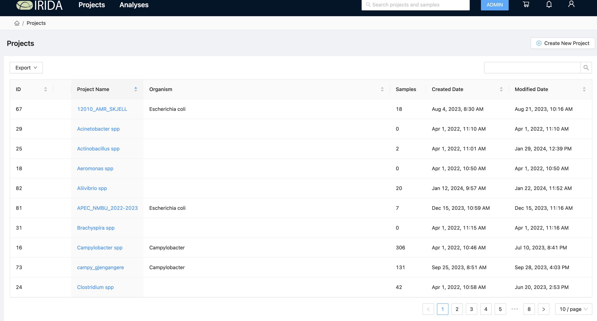
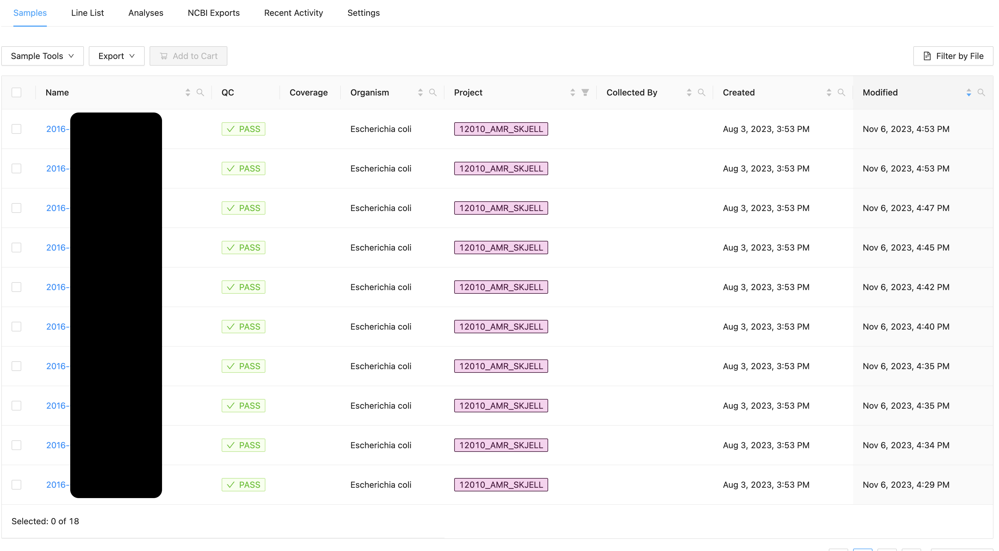

# Data management and access control 
In IRIDA, all data (Fastq files, meta data and results) are organized as projects (species bucket). No data can stand alone. F. ex. All salmonella data are part of "Salmonella spp" project and all Listeria data are part of "Listeria spp" project. Only the members of the project can see, access, analyze and share the data and the results. Users can create projects where they can share the data from main project to do further project specific analysis. 

## Projects in VIGASP
Once the you have logged-in, you will see the projects you are part of like in the image below.      

  

By clicking on the project names, you can see and access the data
  

  

By clicking on the sample name, you can see more information, files (fastq, assembly), metadata and analyses. 
Assembly files will be available only after running "Assembly and Annotation" pipeline. Metadata can either be added one by one manually or using a metadata file (csv or excel) with sample_id. Metadata also contains "selected-formatted" results from analyses using VIGASP pipelines. 

  
  
