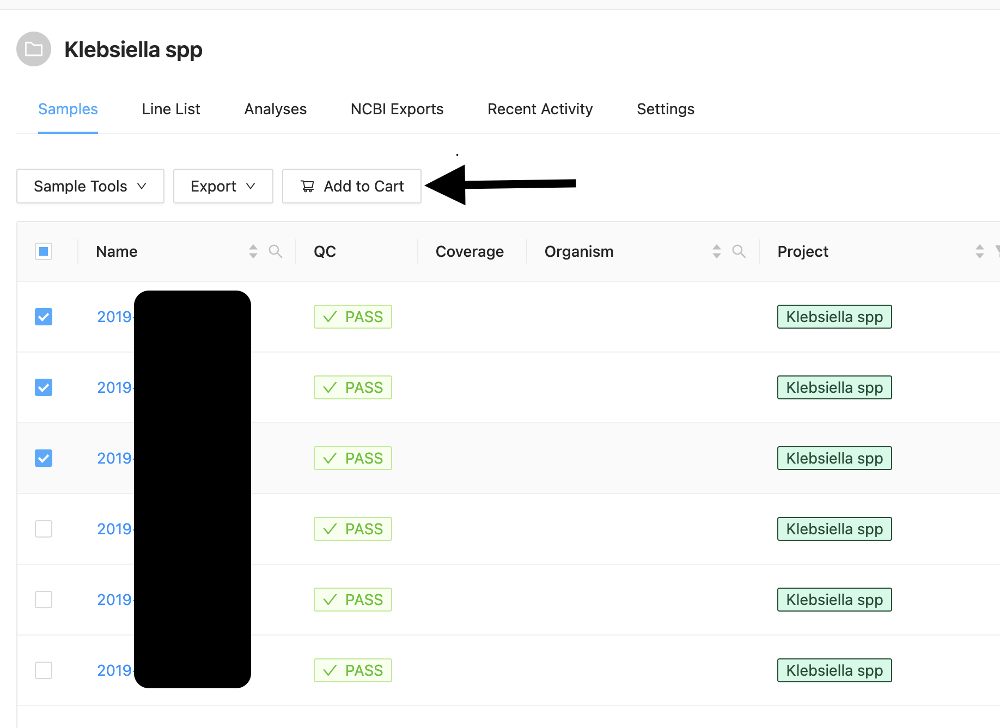

# Pipeline overview 
AS of January 2024, VIGAS has 12 pipelines. 8 of them are developed in house at NVI. Project managers can set up automated pipelines with customized parameters for each project. By clicking on the "shopping cart" symbol in top right corner will take you to list of pipelines available.
  

  

# List of pipelines: 
1. **Assembly and Annotation Pipeline**   
   Shovill assembly, Prokka annotation and QUAST assembly assessment. 
   
2. **MLST Pipeline NVI - Modified by NVI**  
   Pipepline performs Shovill assembly and QUAST assembly quality assessment. And, uses checkm_analyze and checkm_qa for 
   assessing the quality of genomes. 
   
3. **SISTR Pipeline v1.1.1 (NVI)** 
   Scan contig files against PubMLST typing schemes. 
   
4. **Species Abundance** 
   Estimate the relative abundance of reads from each species present in a sample. Taxonomic classification by kraken2 followed by re-estimation by bracken. 
   
5. **Assembly_QC** 
   Pipepline performs Shovill assembly and QUAST assembly quality assessment. And, uses checkm_analyze and checkm_qa for assessing the quality of genomes. 
   
6. **Phylo-CoreGenomeSNP** 
   Phylogenetic analyses of prokaryotic isolates. Suitable only for datasets where the samples are expected to be very closely related. Here, multiple sequence 
   alignment is generated with ParSNP, which takes the whole genome into account.This pipeline is similar to ALPPACA on saga, but not identical. 

7. **Reads_QC** 
    Runs Kraken2/Bracken for species confirmation/contamination-check and fastqc for basic quality control parameters. 
    
8. **ResPointFinder** 
    Uses ResFinder and PointFinder tools to map the Fastq reads to ResFinder and PointFinder databasses and produces a combined formatted output as well. 
    
9. **ResPointFinder2 (EFSA 2022)** 
    Takes Fastq pairedend reads as input and compares against ResFinder and PointFinder database. LineList header prefix is "RPF2305". ResPointFinder tool version: 
    EFSA_2022, ResFinder DB version: EFSA_2022, PointFinder DB version: EFSA_2022. 
    
10. **ResPointFinder3 (EFSA 2023)** 
    Takes Fastq pairedend reads as input and compares against ResFinder and PointFinder database. LineList header prefix is "RPF2403". ResPointFinder tool version: 
    4.4.2, ResFinder DB version: 2.2.1, PointFinder DB version: 4.0.1 DisinFinder DB version 2.0.1. 
    
11. **SeroTypeFinder** 
    SerotypeFinder identifies the serotype in total or partial sequenced isolates of E. coli. 
    
12. **Virulence_Finder** 
    Takes fastq files and compares against Virulence finder database(DTU). 
    
13. **spaTyper Pipeline** 
    Generates spa type identification 

# Analyses 
In order to analyse a sample (or more than one sample), you have to select the samples in the project and click "Add to cart" button to send the fastq files for annalyses.    

    

Once the samples are added, you have to click on the "shopping cart" on the top right corner to see all the pipelines available.   

  

Then, you can choose the pipeline you want to run by  clicking the "Select" button under the pipeline. 

  

