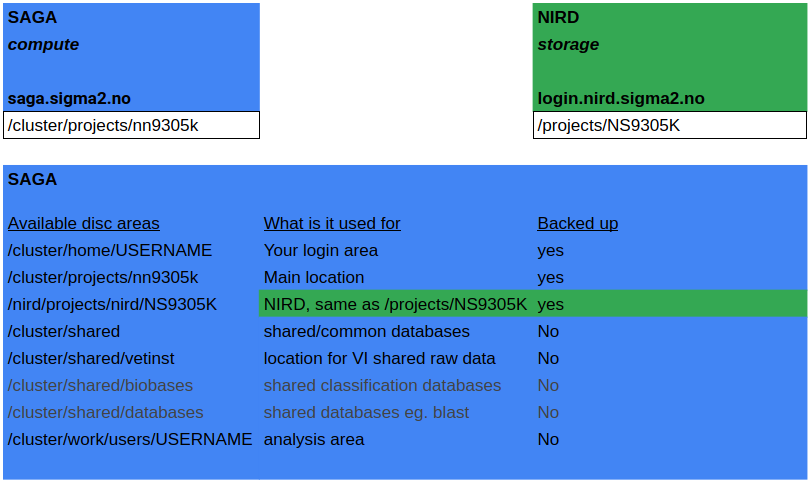

# Saga drive organization

We have access to several drive locations on Saga and NIRD. This document
explains which areas we have access to and how to use them.

## A note on backup
As of fall 2021, there is a 6 months snapshot function on Saga. This means that
the disk areas on Saga are backed up to NIRD. Please note that any changes after
6 months cannot be recovered.

## NIRD and Saga
It is important to remember that NIRD and Saga are two different computers.
However, in every day use, we only access Saga as such. The drives that
are on the NIRD server are available on Saga. However, since they are not
actually on Saga, we should use rsync and not copy/move when shifting data
to and from NIRD.

## Drive locations on Saga and NIRD
These are the main locations that we work with regarding Saga and NIRD.

### Main folders
* /cluster/home/USERNAME - Your login home directory. This is where you end up
  right after login. Do not save data belonging to the NVI in this location.
* /cluster/projects/nn9305k - Main project area. This is the main working
area that you have available for working on NVI data
* /cluster/shared/vetinst - Main raw data directory. All data used for
  calculations should be stored there. Softlink the data in to your active
  directories to work on them.
* /nird/projects/nird/NS9305K - Main NIRD area. This location is actually on
NIRD. This is where long term storage of data should occur.
* /cluster/shared/vetinst - Contains the datasets directory, for datasets under analysis. This folder is not backed up, therefore all datasets must be first deposited on NIRD for safe long-term storage and then copied from NIRD to this folder.   
* /cluster/work/users/USERNAME - A folder that can be used for analyses, ie. if analyses create many temporary files. It is used as such in eg. BIFROST and ALPPACA pipelines. There is no backup of this folder, files are automatically deleted after 21-42 days. Remember copying your results to your dedicated results folder if you use this area.

### Locations under the main Saga drive
* active - all users should have a directory here with their username. This is
  where all work happens
* db_flatfiles - directory with various databases in text format. This is where
  the ariba MLST, AMR and virulence files lives, as well as chewbbaca schemes,
  as well as adapter files for trimmomatic.
* genome_references - this is where reference genome data should go. This is for
  instance the directory used by Bifrost for assembly.
* samplefiles - directory with slurm template files. Also includes the
  procedures for new users, and the setup files that are needed to operate on
  under the vetinst system on saga 

### Shared rawdata directory
* datasets - where all current working copies of raw datasets should go. This
  directory is divided into wgs, transcriptomics and metagenomics. Put your data
  where it belongs. Note: this should only be a copy of what is on NIRD. This
  area has no backup. In case of space emergencies we reserve the right to
  delete any data here without warning (although we will try not to).

### Locations under the main drive on NIRD
* datasets - works the same as the shared datasets directory
* home - each user should have a directory under their username here. This is
  for long term storage of results. This is the NIRD version of the active
  directory on Saga.

## Activities

### Long time storage of raw data
All long term storage of raw data should happen on NIRD, where there is
backup. In the NIRD folder, there is a datasets folder, same as in Saga.
Sequencing done at NVI will put the data there. Make sure you use rsync to
get the data from the NIRD drives to the drives on Saga.

If your data is not sequenced at NVI, you need to ensure yourself that your raw
data is on NIRD.  

### Long time storing of results
All long time storage should happen on the NIRD drives. There are two ways of
doing long time storage there:

* Shared project - if you are working with someone else on this project, create
a top level directory on the NIRD drive, and keep the results there.
* Personal project - if you are not collaborating with someone on the project,
put it in your NIRD home folder.

### Analyzing data
All active analyses should happen in the active folder on Saga. This allows
us to monitor the data usage on the server. For analyses, we suggest the
    following way of organizing things.

* Create a folder inside your active folder, with this format:
year_projectname
* Inside this folder, create a README file that explains to you and anybody
else what this project is about
* Then, create the following folders:
    * rawdata - softlink in your dataset here
    * scripts - any scripts, including slurm scripts go here
* You might have several subtasks that you will do. Create a separate directory
  for each of them, using the format year_month_purpose (for instance
  2020_09_phylogeny). Remembering when things were done is usually easier than
  many other things. You should still have a README file for each subdirectory.
* We also suggest you keep a log file in text format with your analysis. In this
  file we recommend that you not only write down what you did, but why you did
  it. The why is usually the most difficult to remember.
