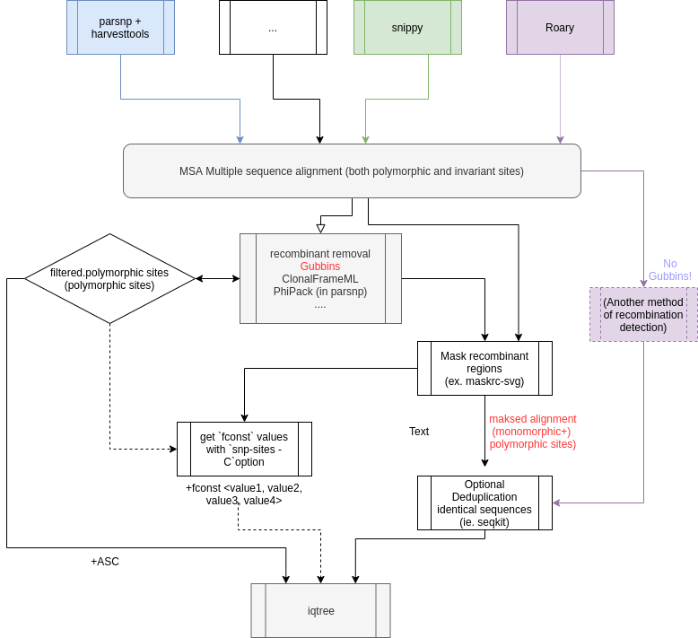

# Intro to phylogenetic trees

## Dictionary

- **invariant sites**: sites (bases at specific loci/positions) that are
  identical for all the analysed isolates/sequences.
- **polymorphic sites**: sites that have variation between the bases
- **Informative sites**: are polymorphic sites that support one grouping of
  taxa over another grouping.  You can read a bit about this concept derived
  from parsimony analysis [here](https://www.mun.ca/biology/scarr/2900_Parsimony_Analysis.htm), in the IQ-TREE documentation (search for
  "LIKELIHOOD MAPPING STATISTIC" in the [Command reference document
  here](http://www.iqtree.org/doc/Command-Reference))

## Introduction

The basic underlying procedure for making a phylogeny is the following:
- There are multiple organisms for which we have DNA sequences. There should be
  at least three. We will call each organism a taxon for this tutorial.
- Next, we align the sequences that we have. The main assumption is that the
  sequences that we align are homologous, i.e, they represent the "same" DNA in
  all of our taxons. The theory is then here that any mutations that are present
  are due to evolutionary changes. We are assuming that there was one
  evolutionary ancestor, which then "split" into two child taxons. Any changes
  we see between the two taxons should then have evolved since the split.
- We then examine the changes between taxons to try to reconstruct how the
  splits can have happened over time. This is done by applying an evolutionary
  model to the changes seen.

## IQ-TREE - a tool for making trees

IQ-TREE is a software that use maximum likelihood algorithm to infer
phylogenies. You can read the article
[here](https://academic.oup.com/mbe/article/32/1/268/2925592), the software and
documentation are hosted [here](http://www.iqtree.org/).

- **Input**: The input for IQ-TREE is a multiple sequence alignment (including
  invariant sites and polymorphic sites) **OR** a MSA consisting of only
  variants/SNPs (polymorphic sites). If the latter is used, more information
  regarding base frequencies etc should be provided. More on tools on getting
  an MSA is described below.
- **Output**: The output from IQTREE is a tree, or a **consensus tree** if you
  used bootstrap to estimate branch support. It should be noted that even if we
  often display support on nodes this is actually branch support. You should
  always have an idea of how branches are supported, because you cannot
  interpret your phylogeny if you do not know how reliable it is. Bootstrap
  support will allow you to determine which groups of taxa you can consider as
  likely true and which ones are undetermined.

## How to get a multiple sequence alignment

There are many tools that do this, and each of them as their advantages and
disadvantages.

Which tool to choose depends how closely related your samples to be
aligned are. You can have a fast estimate using
[FastANI](https://github.com/ParBLiSS/FastANI) (installed in saga)

- For very closely related sequences (≥97% nucleotide identity): use either
  [ParSNP](https://genomebiology.biomedcentral.com/articles/10.1186/s13059-014-0524-x)
  or [snippy](https://github.com/tseemann/snippy) (using a close reference).
  ParSNP is a good candidate if you are very uncertain on what reference to use.
  You can then use one of your own sequences as a "reference". For practical
  purposes that will be discussed later, use the longest of your assemblies.
  Note, in some communities there are fixed procedures, we recommend looking
  at them before choosing a procedure (e.g. for Klebsiella, Snippy is used with
  a fixed reference genome).

- For more distantly related sequences (some isolates < 95%)  you might want
  to consider obtaining an alignment of shared genes, for isntance extracted from
  [Roary](https://sanger-pathogens.github.io/Roary/) pangenome analysis. You
  might also want to consider [Mauve/progressive
  Mauve](https://genome.cshlp.org/content/14/7/1394) (a nice reading to
  understand some problems with MSA of whole genome data). If you cannot use a
  reference, you can e.g. extract concatenated polymorphic sites with
  [ksnp3](https://academic.oup.com/bioinformatics/article/31/17/2877/183216)

This is however NOT an EXHAUSTIVE list of possibilities.

In all cases: you need to understand the hypothesis and main idea on how the
alignment is done, because this will influence which steps you perform,
including whether to remove possible recombination (ie. with
[Gubbins](https://academic.oup.com/nar/article/43/3/e15/2410982)).

**NOTE: Never use Gubbins to remove recombinant sequences on concatenated genes alignment, or on MSAs of only SNPs!.**

## Possible workflow overview

 

## How to create a tree with iqtree?

- You start with a multiple sequence alignment (MSA) with the method of your
  choice.
- If this is a complete alignment, use Gubbins to detect and filter out
  recombinant regions (NB: do not do this if your multiple alignment is a
  concatenated alignment of gene sequences)
- Then you have basically 3 options that will decide how you run IQ-TREE:
    1. You want to run iqtree with the MSA with only polymorphic sites (SNPs).
    This is the fastest way to do a phylogenetic tree. To do this you will have to perform a correction of branch length with `+ASC`  option. **This is the least recommended method because it uses an algorithm  to estimate a correction to be applied on branch lengths.** This the least recommended method because some model use frequencies of ATCG to estimates probabilities of nucleotide substitutions. Those probabilities of nucleotide substitutions can depend on the amount of ATCG you have originally in your genome, and models assume that changes are leading to a "neutral sequence" where each base is represented at 25%" - this is called the "equilibrium frequencies". Some models estimate the probabilities of substitution for each base, depending on what is in your sequences (empirical), and the sequence composition at equilibrium. Consequently, those evolutionary models that depend on estimating the empirical frequencies in your dataset cannot do that on variable sites only, because it might introduce a strong bias in base composition - indeed you might have base composition difference between your monomorphic sites and variable sites.

    2. If you want to only use the MSA with only polymorphic sites, but get a
    better quality phylogeny, you can use the IQ-TREE `fconst` option without
    the ACS option. With `fconst` you should provide the count of each
    nucleotide at the invariant sites (which is used to compute empirical base frequencies, as discussed above).

    As mentioned in [IQ-TREE command reference manual](http://www.iqtree.org/doc/Command-Reference):

    > `-fconst 10,20,15,40` will add 10 constant sites of all A, 20 constant
    > sites of all C, 15 constant sites of all G and 40 constant sites of all T
    > into the alignment.

    This method then requires an additional step: that you find the count for
    each base. This can be done with
    [snp-sites](https://github.com/sanger-pathogens/snp-sites). This method can
    help iqtree run faster, because it does not need to go through the
    sequences to find variants while also estimating the invariant frequencies for
    each site. This means so you can use it when you have a lot of sequences with
    many different snps, but the gain might be marginal. NB: you can read [more
    about fconst and ACS here](https://bitsandbugs.org/2019/11/06/two-easy-ways-to-run-iq-tree-with-the-correct-number-of-constant-sites/))

    3. you provide the multiple alignment with recombinant masked (using `N`)
    and let IQ-TREE find the frequency of invariant base and polymorphic sites -
    this is the easiest option (I think)
