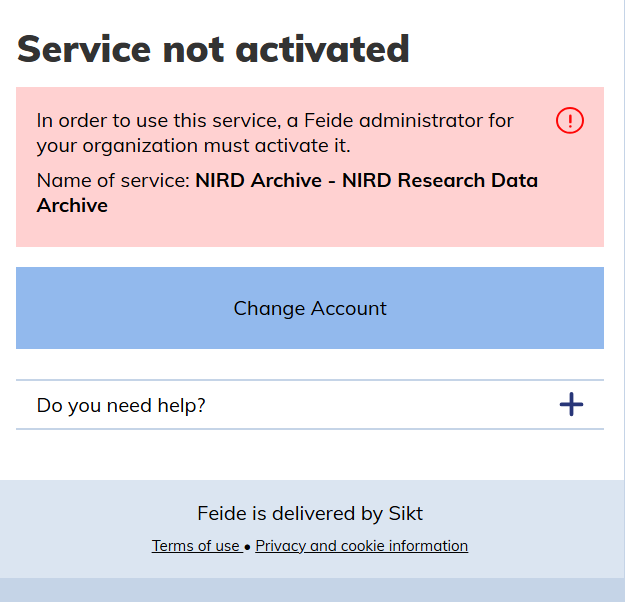
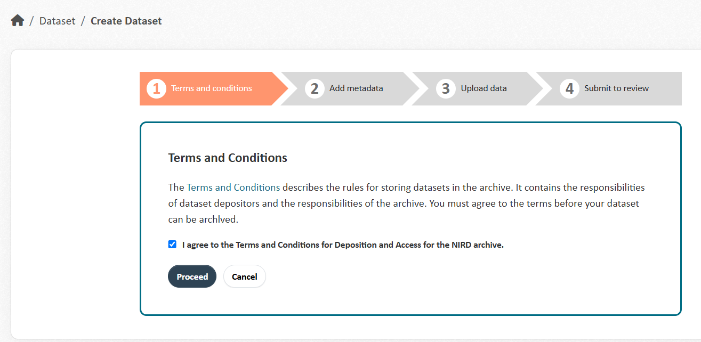
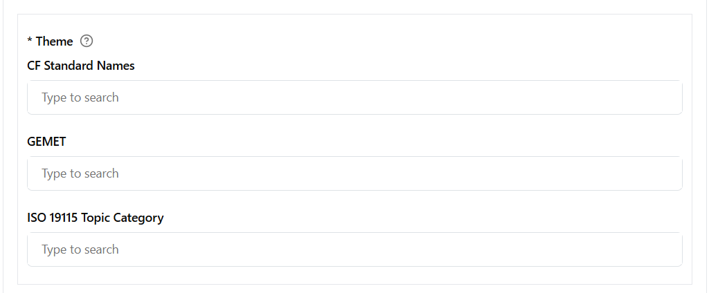
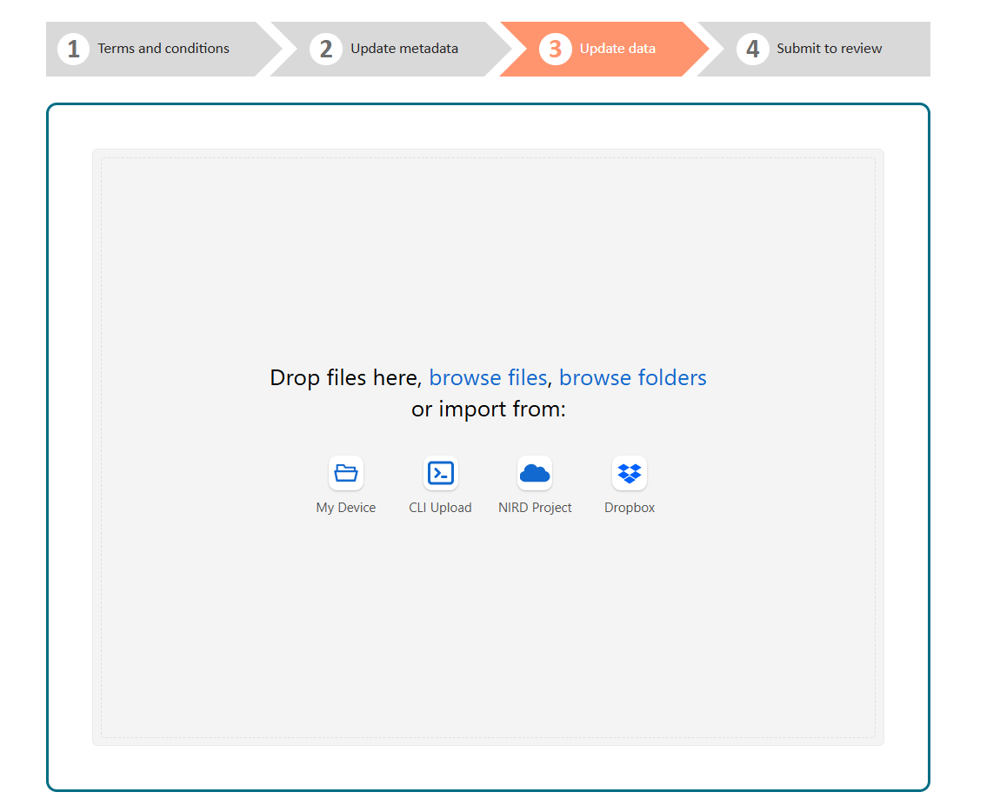
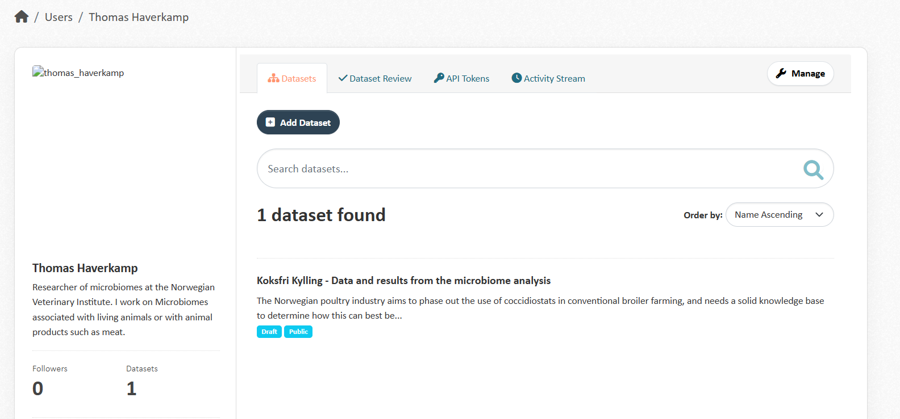
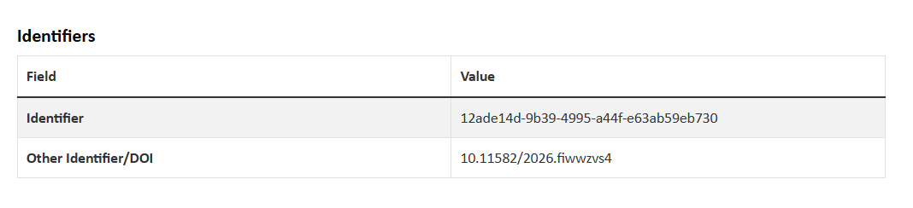
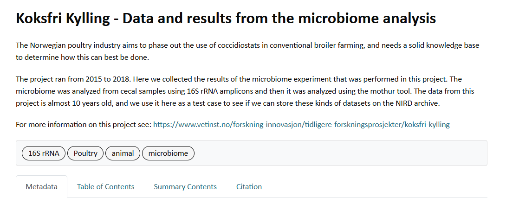
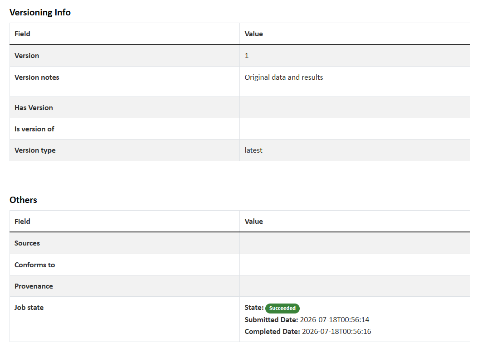
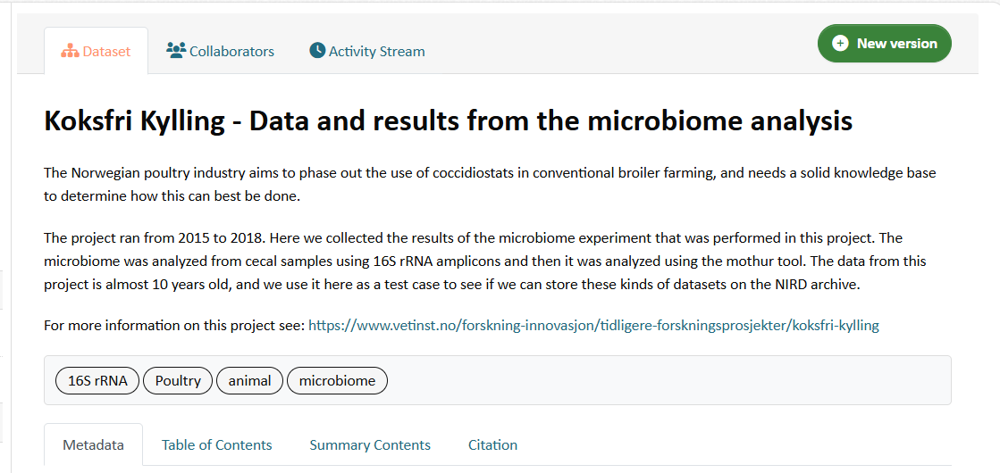
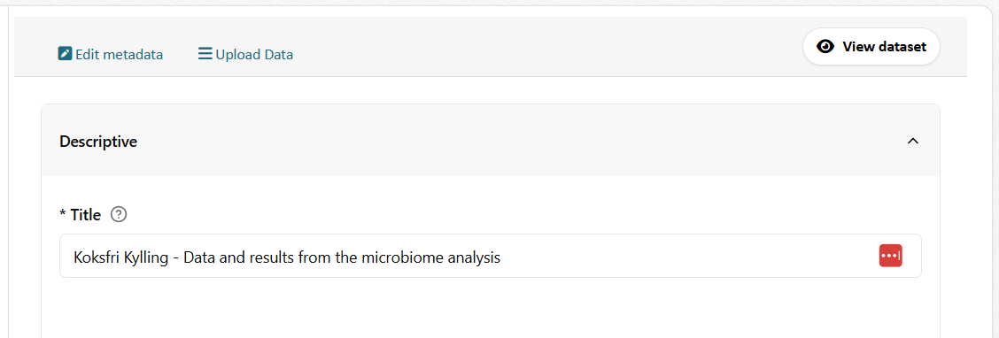

# How to archive a dataset in the NIRD Research Data Archive

**Author:** Thomas Haverkamp   
**Purpose:** This tutorial walks through the process of submitting an old dataset to the NIRD Research Data Archive (NRA), based on a real test submission (the "Koksfri Kylling" dataset). Use it as a step-by-step guide the next time you need to archive a dataset. Or just read through it, to get familiar with the process. The real user manual for the NRA is following the same flow, but omits a lot of details so it get confusing.

## What is the NIRD archive?

The NIRD Research Data Archive is a place to store analysis datasets — for example old project results and script, but not raw sequencing data (that should go into ENA) — that are no longer actively needed at the institute but should be preserved and made findable.

- Archive: <https://archive.sigma2.no/>
- User guide: <https://documentation.sigma2.no/nird_archive/user-guide.html>
- Archive workflow overview: <https://documentation.sigma2.no/nird_archive/archive-workflow.html>

## Before you start

- **Get access to the archive.** Log in at <https://data.archive.sigma2.no/user/login>. Access is possible via Feide, but Feide login may need to be activated for your institute — ask your local IT/NRIS contact if it isn't working yet.

  

- **Identify the dataset** you want to archive, and note where it is stored (e.g. on NIRD `datalake`/`datapeak`) and its size. 
- **Ask permission from the data owner(s)/original project members** before archiving their data, especially if you are not the sole owner. Also check with them whether the data should also be submitted to a public repository such as NCBI/ENA (for sequence data), since this may be a separate step.
- **Clean up the dataset**. Remove any intermediate analysis files that you could recreate by using your analysis / pipelines scripts. These files should not be archived. Archive your final datasets in the following way. First compress all files with gzip to reduce the overall dataset size.  And don't forget to create a file with the md5sum or sha256sum for the datasets in the folder where your data is. File corruption can be tracked by using these values. Then combine all the files of your project into a single tar archive. Also create a md5sum or sha256sum for the entire archive and store that output as a textfile. The tar file and the text file with the md5/sha256 sum will be uploaded to the archive

## Step 1: Start a new dataset entry

In the submission portal, click **Add dataset** to start a new submission.



## Step 2: Fill in the metadata

Next, fill in the metadata for the dataset:

- **Title** – a short, descriptive title.
- **Description** – explain what the dataset contains, the background/context of the project, and how the data was generated/analyzed. Include a link to the project or a relevant publication if available.
- **Keywords** – add a few keywords that describe the dataset (e.g. subject organism, method, sample type).
- **Geospatial metadata fields (CF standard names, GEMET, ISO)** – these three categories are for describing *geospatial* datasets specifically. **They are not relevant for most of our datasets** and can be left empty. If you do want to add something under ISO, a general topical keyword (e.g. "farming") is fine.

  

- **Subject** – choose the relevant subject area (e.g. "Natural sciences").
- **Contact point** – add your institute (e.g. NVI) with your own email address as the contact.
- **Creators** – add yourself and any co-creators of the dataset, with their email addresses.
- **Contributors** – leave blank unless relevant (e.g. an external partner organization).
- **Data owner** – set to your institute.
- **License** – choose an appropriate license (e.g. Creative Commons Attribution 4.0).
- **Access rights** – e.g. "Public".
- **Temporal coverage** – the start and end date of the project the data comes from.
- **Related URL** – a link to the project page, if available.
- **Version note** – add a short note describing which version of the dataset this is.

When you're done, **save as draft**. You can always come back and edit the metadata later.

## Step 3: Choose how to add the data

After saving the metadata, you need to add the actual data files. There are four different ways to do this:



For data stored on NIRD project storage, use the **NIRD Project** option. See also the relevant section of the user guide: <https://documentation.sigma2.no/nird_archive/user-guide.html#nird-project-area-upload>

## Step 4: Prepare the data for upload

Before uploading, organize the files you want to upload. As a minimum, it's good practice to include:

- The actual data archive (e.g. a `.tar.gz` file)
- A `README` file describing the contents
- A checksum file (e.g. `.sha256`) so the integrity of the upload can be verified

Note the full path to the folder where these files are stored — you will need it for the manifest file in the next step.

## Step 5: Create the manifest file

Uploading data via the **NIRD Project** option works through a **manifest file**: a text file that lists exactly which files should be uploaded to the archive.

1. **Find the dataset identifier.** Go to your profile on the archive website and open the dataset you just created (draft). The dataset's unique identifier (a UUID) is shown there — this is what you need for the manifest file name.

   

   

2. **Create the manifest file** in your home folder on NIRD (e.g. `/nird/home/<username>`). The file must be named:

   ```
   .import-archive_<dataset-identifier>
   ```

   For example, if the identifier is `12ade14d-9b39-4995-a44f-e63ab59eb730`, the file would be named:

   ```
   .import-archive_12ade14d-9b39-4995-a44f-e63ab59eb730
   ```

3. **List the files to upload** inside the manifest file, one full path per line. Add an extra `//` in the path right before the part you actually want copied — this ensures only the dataset itself (not the entire directory structure above it) is copied to NIRD. For example:

   ```
   /nird/datapeak/NS9305K/datasets/metagenomics///Koksfri_kylling_rawdata_2017.tar.gz
   /nird/datapeak/NS9305K/datasets/metagenomics///README_Koksfri_kylling_rawdata_2017
   /nird/datapeak/NS9305K/datasets/metagenomics///Koksfri_kylling_rawdata_2017.tar.gz.sha256
   ```

4. **Test the manifest file** before renaming it, by checking that all listed files can be found:

   ```bash
   find $(cat .import-archive_12ade14d-9b39-4995-a44f-e63ab59eb730) ! -type d
   ```

> **Tip:** After placing the manifest file, you need to go to the next step. Your metadata needs to be reviewed.

## Step 6: Submit the dataset for review

Once the manifest file is in place:

1. Go back to the submission portal and set the dataset to **view mode**.
2. Click **Submit for review**.
3. The dataset will be evaluated by an archive manager. Once approved, the data will be retrieved from its location on `datapeak`/`datalake` using the manifest file, and added to the dataset.

When the data has been picked up successfully:

- The manifest file in your home folder on NIRD will have been removed automatically — this confirms it was detected and processed.
- The dataset page will show new sections: **Table of contents**, **Summary contents**, and **Citation**, along with more complete metadata.

  

  

**Note** Sigma2 is investigating how to change the uploading from data so that is becomes a better user experience. Now it is very unclear what is happening, and how to change your dataset. 

## Step 7: Adding more data later (new versions)

If you need to add more data to a dataset after the first upload (for example, uploading the full dataset after first testing with a small subset), you need to create a **new version**:

1. Create a new manifest file with the same name as before (`.import-archive_<dataset-identifier>`) in your home folder, listing only the *new* files to add. You don't need to list files that are already in the archive.
2. In the submission portal, go to the dataset and click **New Version**.

   

3. You'll see two options: edit the metadata, or **delete/modify/upload data**.

   

   - If you are only **adding** new data, you don't need to do anything extra here — your manifest file will be picked up as before.
   - If you want to **delete or modify** existing files, first click **download the table of contents** to get a CSV file listing the current files (URL, format, size, checksum, etc.), which you can use as a reference.

4. Set the dataset to **view mode** again and click **Submit for review**, same as in Step 6.

## Key things to remember

- **Ask data owners for permission** before archiving a dataset that isn't fully your own.
- The **geospatial metadata fields** (CF standard names, GEMET, ISO) can be skipped for non-geospatial datasets.
- The manifest file must be named `.import-archive_<dataset-identifier>` and placed in your NIRD home folder.
- Use a double slash (`//`) in the manifest file paths to control which part of the path is copied into the archive.
- Processing a manifest file can take time — if nothing happens after a couple of hours, it can have multiple causes. For example data from other users first needs to be uploaded. If there are issues, you should get an error message by email. If it takes too long contact NRIS support and ask if they can see if everything is okay or not.
- To add more data after the first submission, use **New Version** with a fresh manifest file. See also: <https://documentation.sigma2.no/nird_archive/user-guide.html#overview-versioning-datasets>
