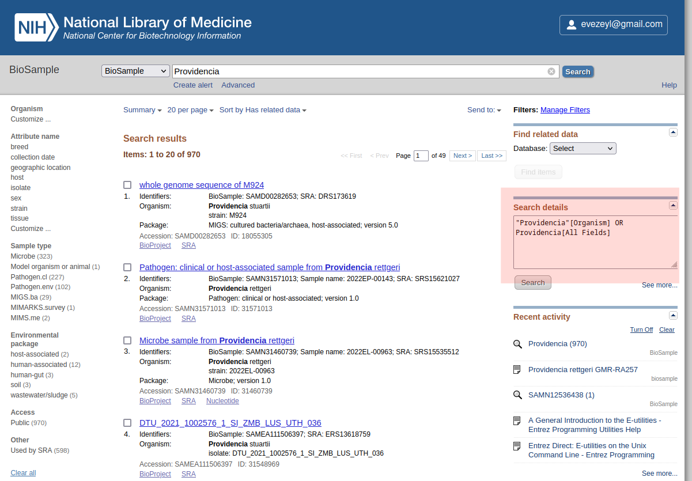
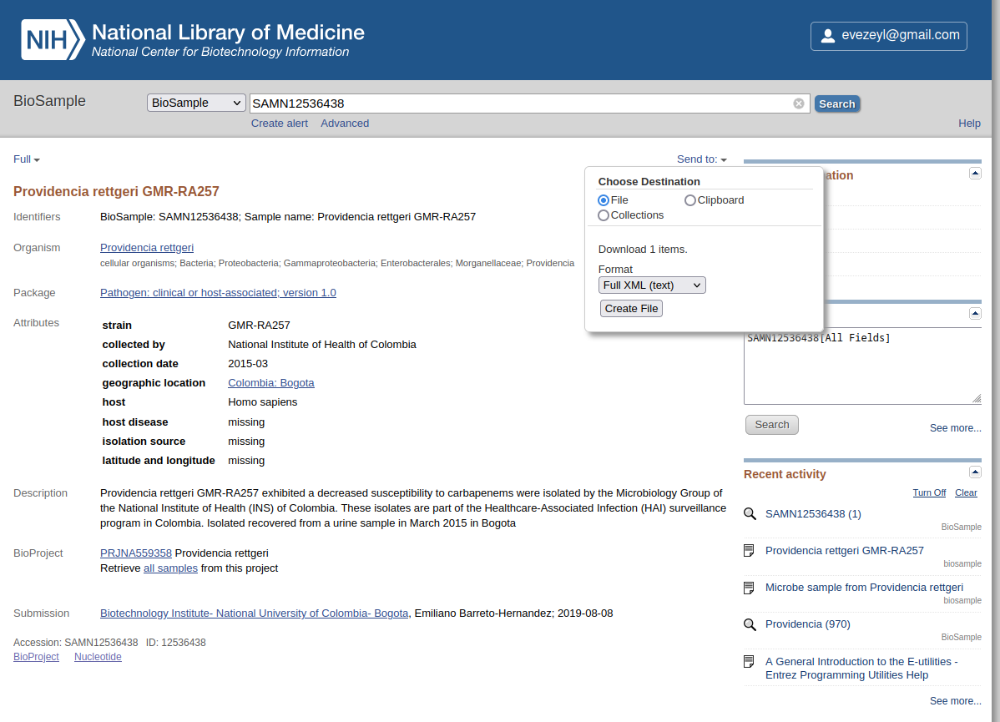

# Get Metadata from NCBI
Here is a solution to search and extract metadata that are associated to the
sequences that are available in NCBI databases, including SRA. With this tool
you can extract large metadata datasets, and obtain metadata in database/table
that are nicely formatted.  

You can eg. get all the metadata from sequences you eg. have downloaded with
[ncbi-genome-download](https://github.com/kblin/ncbi-genome-download) that
is installed in the `ncbidown` conda environment on SAGA.

Assume you have downloaded sequences, and you want to retrieve the data for all
the BioSamples that belong to the genus _Providencia_.

You want to find all the metadata for all the isolates you have, and you want to be able
to use the biosample ID you have to link the metadata you will download to the
sequences you already have downloaded. Note that here I will actually download more
metadata than what I need, but its easy to filter out afterwards those I do not need.

The metadata that will be downloaded is the results that are returned after a
query to an NCBI database. A query can eg. be a specific taxon: species, subspecies.
But a query can be more than that.

The tool we will be using is : [NCBImeta](https://github.com/ktmeaton/NCBImeta)

Example local installation
```
conda create -n ncbimeta -c bioconda ncbimeta
```

It is already installed on SAGA, to use it:
```
conda activate ncbimeta
```

To use ncbimeta, you will need to use an API (application programming interface) key from NCBI.
An API key is an authentication code that will serves to tell NCBI that you are the user
making requests to download metadata via ncbimeta software. Using an NCBI API key
will give you the possibility to send many more queries to NCBI (eg. to download more metadata)
per second than you would be able to perform without it.

To get an API key from NCBI :
- login (or create an account)
- account > account settings : there you can create an API key you will use - copy it and keep it safe

We will need to create a configuration file (.yalm) for each metadata download
we will ask the software to do. The configuration file is not a configuration file to
run the software, but it is a configuration file that specifies the search/query
we are asking the software to do: to retrieve the available metadata we are interested in,
and then the specification of the specific of fields we want to download in a database/table.  

A trick is to create a simple search in NCBI ex:


This search field will help you build your "metadata download configuration file" (.yalm).

Now we do a specific search for a specific sample we are interested in to get the
metadata for, eg. BioSample: `SAMN12536438`. This page give us the information
for the metadata we can have access to and how it is structured in the database.
To ease the process of creating the `.yalm` file we save this data as `xml` and
open it with a web-browser so we can get the structure of the fields we want
information from. 

This gives: [xml_file](./biosample_result.xml).

Compare it to the [.yalm configuration file](./providencia_metadata.yaml)

The `.yalm` file allow to define the destination of the download (OUTPUT_DIR),
your NCBI identification (EMAIL and API_KEY), the name of the sqlite database it will
download the metadata to (DATABASE), the tables it will create within the database
(TABLES) and the columns/fields it will create and download data to for each
table in the sqlite database (TABLE_COLUMNS, indentation: table name you want,
indentation: the field/column names and the metadata that will be downloaded in each)

So, you see that you can define your own fields, that were not provided in the other examples found in the [Biosample example](https://github.com/ktmeaton/NCBImeta/tree/master/schema).

To define those fields you need to access at which hierarchy of the `.xml` file you downloaded as helper.
The different hierarchical levels are defined in order separated by comas eg. `Attribute, harmonized_name, <variable>`  

This [attribute documentation page at NCBI for BioSample](https://www.ncbi.nlm.nih.gov/biosample/docs/attributes/) gives you all the attribute fields that may have been defined. You see that there is the `harmonized_name`column then you know which variable name you should use to get what you want, and all the possible information that may have been registered.   

When you have created the .yalm configuration file as you want, you can try to run it. I will guide you if some fields are incorrect, so you can rectify.

Then you can run the tool.
```
conda activate NCBImeta
NCBImeta --config providencia_metadata.yaml --flat
```

This creates a "sqlite" database.
- You can open it with the [sqlite browser](https://sqlitebrowser.org/) (there is an option without install for windows: portable app). download the version you want to
use. Launch the software and ...

Open the database.
Got to the tabulation "browse", and select the table you want to look at.
It looks like a spreadsheet, this is how you can visualize what has been downloaded.

If you wish,
- You can export the downloaded metadata it into a .csv file (so you can open it in Excel) OR
- You can decide to use this database and increase it to make links with the data you already have. If you do not how: this carpentry course can help you start : [Databases and SQL](https://swcarpentry.github.io/sql-novice-survey/)
- You can interact with the database with python or R. Eg for R, the [**dbplyr**](https://dbplyr.tidyverse.org/) library allows you to use query the database directly, using the **dplyr** syntax (with the pipes) as we have already seen in other tutorials.

A short overview of using with `dbplyr` in R:
```R
# load required packages
library(tidyverse)
library(dbplyr)

# create a connection
con <- DBI::dbConnect(RSQLite::SQLite(), "providencia_db.sqlite")

# Do what you want with your metadata - tidyverse style
con %>%
  # this select the table you want to look at in the database
  tbl("BioSample") %>%
  # what other thing you want to do 
  head(.)

# close the connection
DBI::dbDisconnect(con)
```
