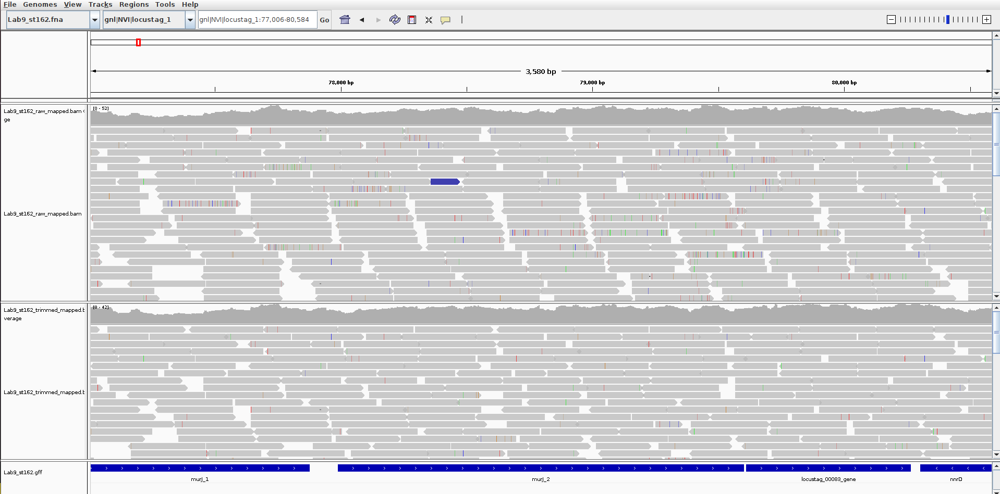
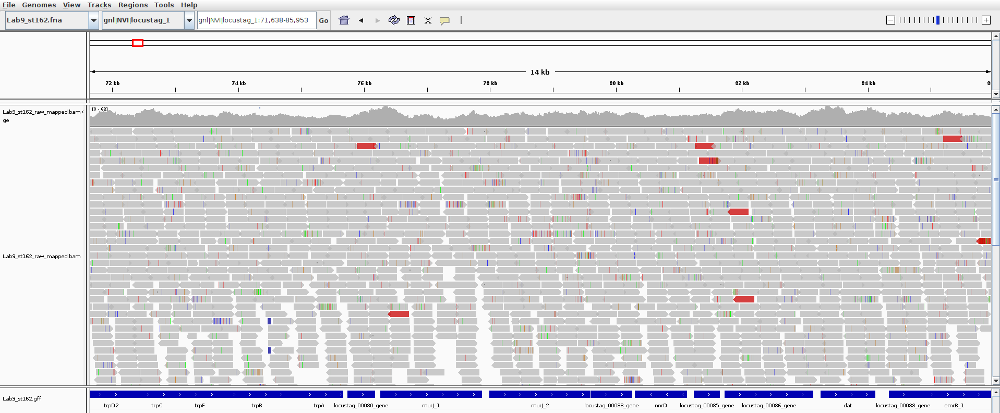
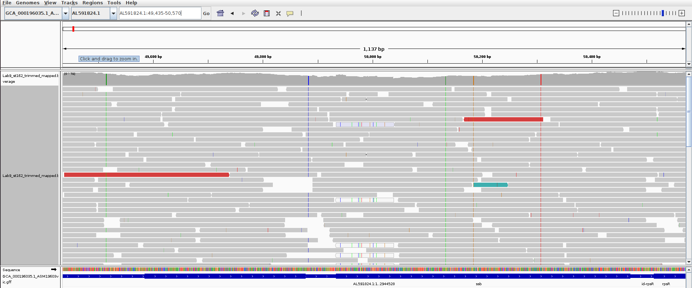
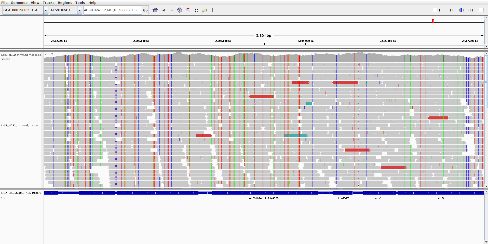
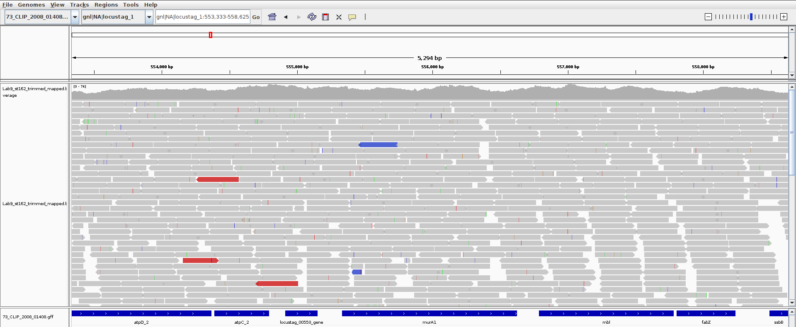
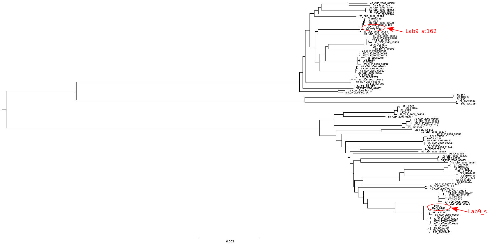
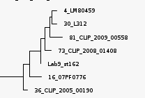
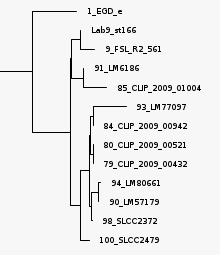
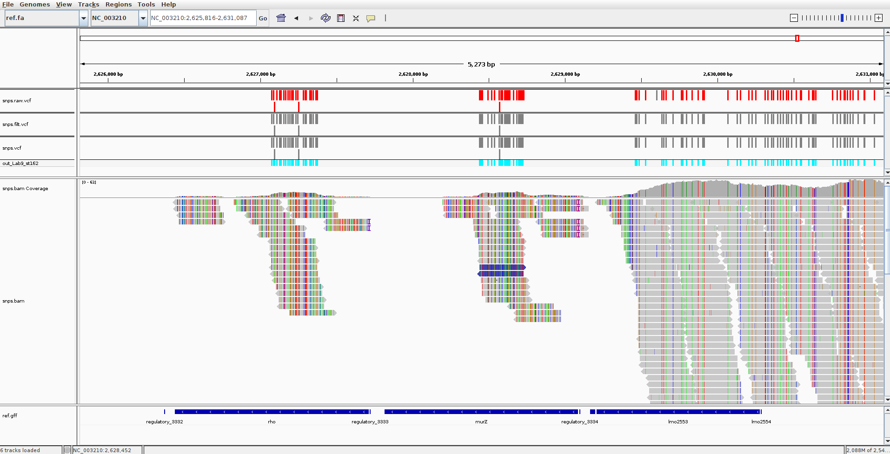
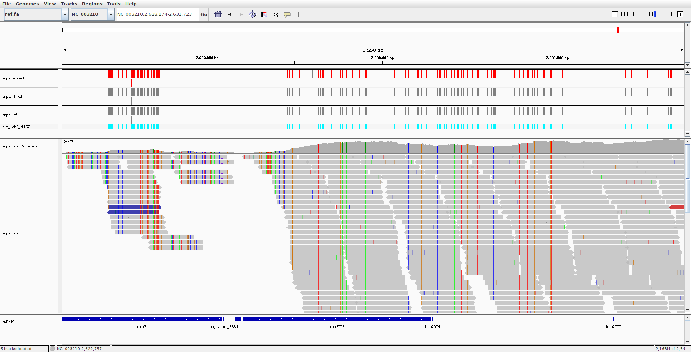

# Variant calling with reads mapping

## How does variant calling with reads mapping work
1. You need to map the reads to a reference.
2. You need to call your variants (detection of what is different to the reference).
3. You filter the variants according to some quality criteria. 

We will use _Listeria monocytogenes_ from the EURL proficiency test 2021 in this tutorial.

Our objectives with this tutorial are to:
1. Show you what data a variant caller that use mapped reads has to deal with before producing results you can trust.
2. How the choice of a reference influence what/which variants are detected
3. Provide a basic understanding of what and how a variant caller filters noise/errors in the mapped data in order to provide reliable variant calls that you can trust (or not).
4. Provide some ideas of how you can adapt variant calling to your purposes.

The data used for this tutorial is deposited in the SAGA directory : `/cluster/projects/nn9305k/tutorial/20211108_trusting_snps`

Information about the isolates used in this tutorial:
- Isolates have been sequenced with NextSeq.
- Assemblies have been done using [bifrost](https://github.com/NorwegianVeterinaryInstitute/Bifrost/wiki)

We evaluated the assembly quality with  `quast`, using the _L. monocytogenes_ reference genome: EGD-e (CA_000196035.1_ASM19603v1_genomic). The report indicate that the strain `Lab9_st166` share a high genome fraction with the reference EGD-e, whereas the strain `Lab9_st162` share around 60% of the genome with EGD-e. We will use those two isolates during the tutorial.


## What is a variant: read mapping and what does the variant caller has to deal with?

A variant represents a difference to another isolate/reference, for instance a point mutation or SNP, an insertion/deletion (which are the subject for today) or eg. structural variants.

We have mapped those strains with [BWA MEM](http://bio-bwa.sourceforge.net/) (eg. see [ ]() tutorial). BWA MEM , a mapping method that performs **local alignment**. We have used this program against:
- the reference EGD-e
- another reference that is more closely related to the strain (see note below: How to rapidly find reference for you isolates when you have no idea what to choose ?)
- their own assembly. We used the genome sequence `.fna`  provided by `prokka` annotation for mapping isolates against their own assembly to insure that locus tags are consistent with annotation and ease visualization with [IGV](https://software.broadinstitute.org/software/igv/) Integrative Genomic Viewer (see [ ]() tutorial).

We used the **defaults parameters** for the mapping. Note however this might be adjusted to allow more strict matches of the reads to the sequence.
We have used both raw reads and trimmed reads for mapping. So we can have an idea of the amount of noise (incl. false variants) that a variant caller must deal with.

You will find the files for the tutorial in SAGA:
- mapping for strain: Lab9_st162 `/cluster/projects/nn9305k/tutorial/20211108_trusting_snps/Lab9_st162`
- mapping for strain: Lab9_st162  `/cluster/projects/nn9305k/tutorial/20211108_trusting_snps/Lab9_st166`
- the annotation files for each genome used for reference mapping are provided in the sub-folder `prokka_gff`

PS: The BAM/SAM format of sequence/reads mapping is described [here](http://samtools.github.io/hts-specs/SAMv1.pdf)

### Summary: how to load data into IGV

We will now use the program IGV to look at the mapping results.

1. Loading your assembly:
	In IGV meny select: `Genomes > Load genome from file` and choose the assembly/reference to load (`.fna`)
2. Add the mapped reads (raw, trimmed) and the annotation file as track
	In IGV meny select: `File > Load from file` and choose the mapped read file (`.bam`) and the `.gff` file corresponding to the assembly/reference

We can look for genes to manouvre in the genome: in the search box (left of go) type eg. murJ. The allows you to quickly find the gene:  Lipid II flippase MurJ,  (Locus murJ_1 and murJ_2)

In here you can find information on the color coding for [alignments in IGV](http://software.broadinstitute.org/software/igv/AlignmentData) and how to change the different color coding views.

The color coding used in the viewer is described in [IGV manual](http://software.broadinstitute.org/software/igv/AlignmentData)
- In red: insert size that is larger than expected (possible evidence of a deletion).
- In blue: inferred insert size that is smaller than expected (possible evidence of an insertion).
- Mismatched bases in aliments are assigned a transparency value (proportional to the phred quality score).
- Transparency (white transparent box) is used for mapped reads with low mapping quality (eg. mapped at several loci).
For more information look [here](https://software.broadinstitute.org/software/igv/AlignmentData#fileformats).


### Practical: Mapping approach and data noise/errors

We will in this section have a look whether we can see the following things:
- Sequencing errors / low quality bases
- Adapters (not trimmed, incompletely trimmed)

**Visualizing with IGV: Comparing one isolate where both trimmed reads and raw reads have been mapped to its own assembly**
- choose one strain. Upload the assembly, and the mapped reads (both raw reads and trimmed reads) and upload the annotation file.
- find the gene `murJ` annotation murJ_2. You can zoom in an out

Here is an idea of what you should be able to look at:

| Raw VS trimmed | Colors Interpretation |
| ---- | ----|
|| |

- The reads with many vertical lines are reads that are poorly mapped to the genome or have bases with low quality scores (where many inconsistencies with the consensus sequence are found).
- Look at the pileup, and zoom in and out.
- What are the likely errors, what are the adapters ...

NB: With Lab9_st162 mapped to EGD-e with trimmed reads, you can see reads with low mapping (eg. mapped at several places) by looking around the gene `ssb`.




**When mapping directly from raw-reads: the variant caller will have to deal with noise, to distinguish between real SNPs in pileup vs sequencing errors and remaining adapters.**
Soft-clipping at the extremity of the reads, is excluding those extremities as to be considered part of the alignment.

### Practical: Influence of reference choice for variant calling using a mapping approach
Variant detection on a single isolate using a reference:
- closely related reference
- distantly related reference

**Visualisation with IGV:
Choose one isolate mapped with trimmed reads to two different references sequences**
Here we use trimmed reads (so we remove some low quality and noise data). This will allow us to look at the effect of reference choice for variant detection
PS: if you do not find `murJ`look at eg. `MurA`, `MurA1` genes and scroll around.

In IGV the symbol `I` indicates insertions and black `-` deletions.


| Lab9_st162 to EGD-e | Lab9_st162 to 73_clip (close) |
| -------- | -------- |
|  |  |


**The amount of variant discovered depend on how closely related your reference is to the strain(s) used for discovering variants.**
Questions:
- Lab9_st166 is quiet closely related to EGD-e. Did choosing an other closely related strain as reference reduced the number of potential snps?
- Lab9_st162 is quite distantly related to EGD-e. How do you think the reference choice will influence your analyses for SNP detection?


The variant caller must discriminate between real variant and "noise" (sequencing error and absence of trimming).

The choice of the reference used in variant calling will influence which variants are detected, as a variant is a difference in base relative to another sequence used as reference. For detecting variants between multiple samples, a common reference has to be used.

Having a common reference that is as closely related as possible to the common set of isolates is important when you want to do phylogenies based on SNPs. Every site that produce indel will be removed from the phylogenetic reconstruction (unless a special model that account for indels is used).

If a reference it too distantly related, it is possible that many of your reads wont map to the reference (as they are too different, they might not be considered for local alignment). This might reduce your ability to detect variants in the loci that not very conserved in the genome.

### Mapping quality scores / mapping quality: MAPQ
There is little or no documentation in mapping software on how the different software are computing mapping quality scores.

[BWA-MEM](http://bio-bwa.sourceforge.net/bwa.shtml#6) has a score for alignment that depends on the parameters used to perform the local alignment and penalties associated to mismatches detection, penalties associated to gap opening and gap extension. Mapping quality scores (MAPQ) in BWA MEM are **phred scaled** and in the range [0-60], where 60 corresponds to uniquely mapped reads (high quality).

Note that the MAPQ scores are not directly comparable in different mapping software [see eg. Olson et al. 2015](https://www.frontiersin.org/articles/10.3389/fgene.2015.00235/full). Note also that BWA and BWA MEM are two different algorithms with different mapping scores.

Here are some blogs that relate to this problem:
- [MAPQ-values: implementation is a mess](https://sequencing.qcfail.com/articles/mapq-values-are-really-useful-but-their-implementation-is-a-mess/)
- [Understanding MAPQ scores in SAM files](http://www.acgt.me/blog/2014/12/16/understanding-mapq-scores-in-sam-files-does-37-42)
- [More madness in MAPQ scores](http://www.acgt.me/blog/2015/3/17/more-madness-with-mapq-scores-aka-why-bioinformaticians-hate-poor-and-incomplete-software-documentation)

You can also have a look at the article [Li et al. 2008](https://pubmed.ncbi.nlm.nih.gov/18714091/) and their [supplementary information](https://genome.cshlp.org/content/suppl/2008/09/26/gr.078212.108.DC1/maq-supp.pdf)


### Note: How to rapidly find reference for you isolates when you have no idea what to choose ?
You can eg. use the software [poppunk](https://poppunk.net/) on a diverse set of reference isolates. Then if all your isolates belong to the same cluster, you can choose a reference that belongs this same cluster. If not all your isolates belong to the same cluster, you can look at the phylogenetic tree and choose eg. a reference that belong to the same monophyletic group (most recent common ancestor/node shared with all your isolates).

Another solution, is eg. to run a type of typing eg. 7 gene MLST typing and choose a reference that belong to the same ST. This can be done eg. with [MLST software](https://github.com/tseemann/mlst)

For this tutorial, we used [poppunk (version 2.4.0)](https://github.com/johnlees/PopPUNK) to search for an appropriate references, as it is fast to do for a large dataset, much faster than a core phylogeny.
We used the sequence-dataset composed of the isolates that were used to define the [Listeria monocytogenes cgMLST scheme](https://bigsdb.pasteur.fr/listeria/) described in [(Moura et al. 2017)](https://www.nature.com/articles/nmicrobiol2016185). The strain diversity in this dataset is expected to be representative of _L.monocytogenes_ diversity, therefore allowing us to find alternative reference for SNP calling with our strains.

A tabular delimited file containing the ID and the paths for poppunk is created, without headers. We removed potential outlier genome by pruning (it just remove the sequences that are outlier from the analyses).

NB: We have checked that the model fit well (it is not always the case, but for _Listeria monocytogenes_ it works well).

We created a phylogenetic tree to visually find which references sequences are more similar to our own genomes.

```bash
# These are the command used for creating the tree to find a reference using poppunk
cd <popunk_analysis_directory>
# create a tab delimted file with ID and path, no headers
# poppunk 2.4.0
conda activate poppunk
# creating the database and distance - used the mourra isolates - removing eventual poor isolates
poppunk --create-db --output listeria_db --r-files r_files.txt --qc-filter prune
# fitting the model
poppunk --ref-db listeria_db --fit-model dbscan
# we get the visualisation
poppunk_visualise --ref-db  listeria_db --microreact --tree nj --output visualisation_out
```

Then we can chose a reference that is more closely related to our isolates than our initial choice



| Lab9_st162 | Lab9_st166 |
| -------- |   ---------- |
| Closer reference for 73_CLIP_2008_01408 | Closer reference for 9_FSL_R2_561 |
|  |  |


## How to find variants: example using [snippy](https://github.com/tseemann/snippy)

Snippy uses a mapping to a reference to find variants (SNPs/indels). The use of a common single reference for variant detection on multiple isolates provides a coordinate system (the position of each SNPs for each isolate is given according to the position in the reference sequence) that allows to combine the variants found in each isolate together in a single variant alignment.

Typed variants can be represented in a **variant call format** `.vcf` file. This file report the differences of nucleotides/indels of a/several isolates **relative to the reference sequence**. It also provides the statistics calculated by the variant caller eg. the likelihood of a variant base to be different to the reference. A set of measures are provided (depending on variant caller), eg. base confidence at mapping, filters used, probabilities calculated in the pileup. An overview about the format can be found [here](https://samtools.github.io/hts-specs/VCFv4.3.pdf) or in [wikipedia](https://en.wikipedia.org/wiki/Variant_Call_Format) for a fast overview.

**Snippy removes duplicated reads prior to variant calling.** (Duplicated reads would lead to an inflated weight when calling variant based on how frequently they are found in a pileup). This is something that you should keep in mind if your read set contains a lot of duplicated reads.

Snippy can be run using an assembly (.fasta) or annotated genome (.gbk: genebank format) as reference. Here we will call variant using a reference provided in the genebank format, as this will ease visualization of the variants files and allow to navigate from loci to loci while using IGV.

**Practical**
Create a directory for one isolate, and create a symlink to the files .

```bash
cd <directory>
# example simlink
ln -s /cluster/projects/nn9305k/tutorial/20211108_trusting_snps/snippy/input/Lab9_st162/* .
ln -s /cluster/projects/nn9305k/tutorial/20211108_trusting_snps/snippy/GCF_000196035.1.gbk .

# request ressources
screen
srun --account=nn9305k --mem=32G --cpus-per-task 4 --time=1:00:00 --pty bash -i
# activate snippy
conda activate snippy
# Run snippy (the --report option is heavy - please someone do without?)
snippy --outdir out_Lab9_st162 --ref GCF_000196035.1.gbk --R1 Lab9_st162_R1.fastq.gz --R2 Lab9_st162_R2.fastq.gz --cpus 4 --report
```

Look at the filtered variant file. The report is generated with [samtools view](http://www.htslib.org/doc/samtools-tview.html).
```bash
less snps.filt.svc
```

1. Headers of interest
	1. vcf File format version
	2. command line to generate the variant file
	3. descriptions of the abbreviations in variant calls (read depth, likelihood of , type of variant: eg indel, SNP)
2. Variant call
	1. contig (chrom)
	2. position(relative to reference)
	3. variant allele
	4. and other fields described in the header.

### Bonus: detecting variants with snippy multi
Snippy run can be run on multiple samples using the same reference for variant detection.

You can eg. use Haukon's script [here](https://github.com/NorwegianVeterinaryInstitute/ALPPACA/blob/master/bin/snippyfy.bash). Or the example bellow that I use to create snippy multi-input files. In this example, reads pairs for each isolate are organized in their own folder. The folder name is named after the isolate ID. The input folder `snippy_input_dir`  contains all the directories of all isolates we want to run with snippy.

```bash
# example of creating the snippy multi-input file
snippy_input_dir="/cluster/projects/nn9305k/active/...input/"
cd $snippy_input_dir

# creating an array of ID based on a list of folders
id=($(ls -d Lab9_st16*))
# checking that the this is correct
echo ${id[@]}

function create_snippy () {
	for ((i=0 ; i < ${#id[@]} ; ++i ))
	do
	R1=${snippy_input_dir}/${id[i]}/*_R1.fastq.gz
	R2=${snippy_input_dir}/${id[i]}/*_R2.fastq.gz
	printf "%s\t%s\t%s\n" ${id[i]} ${R1} ${R2}
	done
}
create_snippy > snippy_input.tab
```

Running snippy multi:
```bash
srun --account=nn9305k --mem-per-cpu=32G --time=1:00:00 --pty bash -i
snippy-multi snippy_input.tab --ref <path>/GCF_000196035.1.gbk > created_snippy_run_script.sh
# veryfing that the script has been created
less created_snippy_run_script.sh
# launching the script
bash ./created_snippy_run_script.sh
# wait ...
# cleaning the alignment for further processing (eg. gubbins)
snippy-clean_full_aln core.full.aln > clean.full.aln
```

Snippy produces a multiple core alignment. The common reference serve as common coordinate system and allow to reconstruct an alignment from the common part of the genomes (core). All the variant detected at all positions of the reference are merged into one file for all isolates under study.

## How to trust your variants?: example using snippy
### Principles of variant calling in snippy
**Snippy uses several filters are used to remove errors/noise variants. [Freebayes](https://github.com/freebayes/freebayes) is the variant caller used by snippy.**
- reads are uniquely mapped with BWA-MEM (corresponding to a mapping score of 60).
- Duplicated reads tagged and then removed from variant calling.
- the number of bases that are allowed to be soft-clipped at the extremities of the reads before discarding alignment can be adjusted.
- The variant caller Freebayes is used to determine the most likely haplotype in short-read alignments; by extension which base(s) is/are  more likely at each position in the reference. The proportion/frequency of variants that differ to the reference can be adjusted to strengten discriminating between noise and potential true variant.
- The set of variants is then filtered, to ensure removal of variants detected due to noise/errors. The filters rely on :
	- QUAL = the probability that there is a polymorphism at the loci $\1-P(homozygous|Data)$. Snippy use a default of 100(%)
	- DP = the coverage/depth (default to 10 in snippy)
	- A default base-quality of minimum phred score=13 is used for a variant calling (error rate of  ~5%) . This differs from the default settings of Freebayes (phred score=20, which correspond to an error rate of 1%. See eg. [here]((https://gatk.broadinstitute.org/hc/en-us/articles/360035531872-Phred-scaled-quality-scores)).

NB: depending on your objective, you might consider to adjust the minimum coverage/depth, the minimum fraction/proportion and variant probability. Eg. if you (1) have a very deep sequencing (2) have contaminants or eg. (3) want to call "real" rare intra-isolate variants and not solely the majority variants (4) OR you want to solely obtain the majority variants.

### Practical
We can now look at the variants typed by snippy.

We ran snippy using the option `--report` to create a variant report. It used [samtools tview](http://www.htslib.org/doc/samtools-tview.html) to create this report.

**Have a fast look at the report**
```bash
less snps.report.txt
```

Lets look at the variant calling files in IGV and compare it with previous mappings. [Guide: IGV vcf viewing](https://software.broadinstitute.org/software/igv/viewing_vcf_files)
- load the reference genome `ref.fa` (in the  the sub-folder `reference` from snippy output)
- load the files:
	- mapped reads `snps.bam`
	- the reference annotation  `.gff` (in the  the sub-folder `reference` from snippy output)
	- the unfiltered variants `snps.raw.vcf`
	- the filtered variants `snps.filt.vcf`
	- the final variant file `snps.vcf`


**Look at the genes/loci: eg for the isolates, and also navigate through the genome view. Try to answer questions below.**
- Lab_st162: eg. look at: MurA (we looked at previously), MurZ, lmo2553 and eg. regulatory_3308 , lmo 2821 ...
- Lab9_st166: eg. look at: no variants MurA, around lmo 2566, lmo 2652, lmor14 (eg.poor mapping quality), lmo2396 (many messy mapped reads) ...
- scroll through the genome to get a general impression

**Questions:**
- Do the variant appear randomly distributed ?
- Where are variants filtered due to low coverage?
- How often to it appears that variants are filtered due a low fraction of reads that differ to the reference?
- How often do the 3 types of `.vcf` files appear not to be concordant ?
- What should/could we have done in a better way/otherwise ?

| eg. MurZ coverage | eg. lmo2553 Filtering effect |
| ----------------- | ---------------------------- |
|  |  |


# Related tutorials
- [Mapping reads agains a reference/assembly](./mapping_reads_reference_assembly.md)
- [Visualizing assembly and associated reads pileup with IGV](./Visualisation_assembly_reads_pileup_IGV.md)
