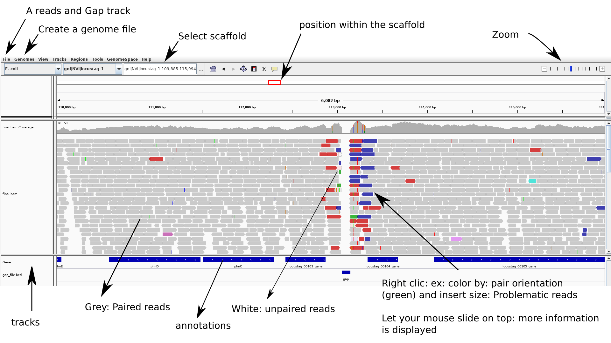

# Visualizing assembly and associated reads pileup with IGV

 The [IGV: Integrative Genomics Viewer](http://software.broadinstitute.org/software/igv/home) software allows to visulally explore and scroll through sequences, that may or not be splitted in contigs, and may or not be associated with reads pileup. It can eg. allow you to detect specific positions were variants are errorneous (eg. at the end of contigs where reads are poorly mapped) and visualize eg. locations where coverage is not homogeneous (ie. repeated regions that are not proprely assembled).

 NB: Convention: means `<change_me>`

## 1. Getting IGV

- you can install IGV on your pc do so.
- you can use SAGA with a graphical user interface

### 1.1. Installing IGV on your PC
If want to do that at your PC you can install IGV as such

<div style="background-color:silver">

_**PRACTICAL EXERCISE:**_

```bash
conda create -n <envname> -c bioconda igv
conda activate <IGV:envname>
```
</div>

### 1.2. Connect to SAGA with a graphical interface

Please see the techinical: [Using a graphical window in SAGA](../technical/Saga_graphical_interface.md)

## 2. Example: Using IGV with reads mapped to its own assembly

We have assembled reads and annotated using Bifrost pipeline. The data for today's practical are found in  `/cluster/projects/nn9305k/tutorial/20210412_mapping_visualization/visualisation_files`

Files description:
- the assembly (polished with Pilon, **output provided by Prokka annoation** ) is: `MiSeq_Ecoli_MG1655_50x.fna` (fasta format)
- the genome annotation is the file (.gff) provided by `Prokka` : `MiSeq_Ecoli_MG1655_50x.gff`
- the final `.bam` file: `final_all_merged.bam` that contained the mapping of the PE and Unpaired reads to the assembly (used as reference)
- A `.bed` file (or gap track): `MiSeq_Ecoli_MG1655.bed` that allows easily identification of scaffolds limits (gaps).

> NB: you can see you to generate those files see the tutorial: [Mapping reads against a reference/assembly](./Visualisation_assembly_reads_pileup_IGV.md) and in the [Creating gap tracks](./Creating_gap_tracks.md) tutorial


If you work on your pc you want to transfer those files to a local folder


```bash
# transfering from SAGA
rsync -rauPW  <user_name>:<source_folder>  <destination_folder>
```
</div>
</br>

Now you can load those files in [IGV](https://software.broadinstitute.org/software/igv/)



<div style="background-color:silver">

_**PRACTICAL EXERCISE:**_

1. Create a `genome file` this allows associating tracks to the assembly : `Genomes > create.genome file`. Use the menu to select your assembly file `.fasta`and the annotation-gene file: `.gff`.
> NB: You need to fill the `unique identifier` AND `descriptive name` fileds.

2. Locate and Load your `mapped reads` and the `gap file` using: `file > load from file`
  - if you use SAGA here: you need to navigate throught the file structure:  cluster>projects>nn9305k>active> and your own folder

3. To be able to easily re-open (without re-importing everything you can do): `file > save session`
  - be carrefull where you save in the navigator when using SAGA

Now you are ready to navigate and explore your assembly.

</br>

**Try to find a gap.**

**NB**: To zoom while staying centered on the gap: click above menu (position within the scaffold - at the gap - top track) then click with the mouse at the gap position on the gap track (until appropriate zoom is obtained).

You can look here for [Options and interpretation](http://software.broadinstitute.org/software/igv/PopupMenus#AlignmentTrack),
and here: [PE orientations](http://software.broadinstitute.org/software/igv/interpreting_pair_orientations).

**Have a look at:**
- coverage
- gaps positions
- some strange scaffolds?
- PE orientations: in detail how the reads map to your assembly (you will need to zoom a lot)
- are some PE reads miss-oriented? reported as having abnormal insert sizes?

</div>
</br>

## Troubleshooting

To be able to link the positions in the assembly to the annotations, the scaffold names between assembly and annotations files have to be consistent when provided as input file into IGV.

This is why we used the assembly that prokka outputs in the present example (this is the sequence is the same as .fasta assembly polished by pilon). Indeed, `Prokka` transforms scaffold names from the assembly used as input. If scaffold names in the annotation file and sequence file are not consistent, IGV will not manage to link the information of both files.

If you encounter such case, and do not have access to the assembly provided by prokka, the solution is to use an alias file. The alias file will provide to IGV the correspondance between contigs of your sequence/assembly and the annotation file. This is [described here](https://software.broadinstitute.org/software/igv/LoadData/#aliasfile)
