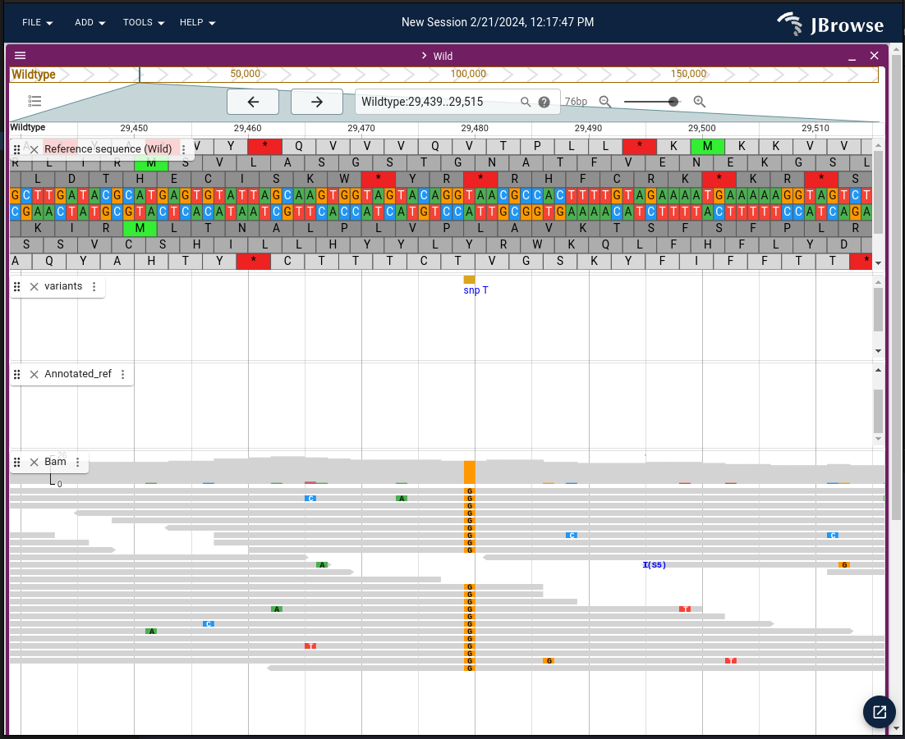
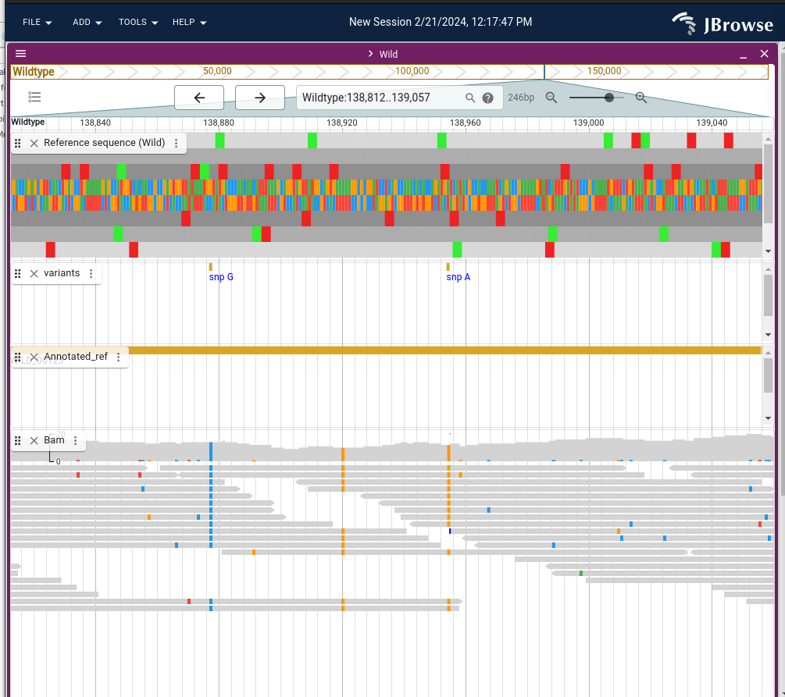

# Using [bcftools] : Utilities for variant calling and VCF (variant call format) files manipulation

## Background

There many variant callers, and the variants discovered differe to a certain extend between tools. 

This is due to several reasons: 
- data preparation:
  - sequencing depth / coverage and quality
  - accuracy and or variation during read mapping (eg. different algorithms can lead to different optimal mapping) to a reference genome[^1]
- different algorithms and criteria during variant calling and filtering

> You can read about some studies highlighting those variant calling differences. Some and non exhaustive examples:
[Hwang etal. 2015](https://www.nature.com/articles/srep17875)
[Barbitoff etal. 2022](https://bmcgenomics.biomedcentral.com/articles/10.1186/s12864-022-08365-3) 
[Andreu-Sánchez etal. 2021 ](https://www.frontiersin.org/journals/genetics/articles/10.3389/fgene.2021.648229/full)
with recommendation for metagenomic samples,
[Mey Seah etal. 2023](https://journals.asm.org/doi/10.1128/jcm.01842-22) and 
[Olson etal 2015](https://www.ncbi.nlm.nih.gov/pmc/articles/PMC4493402/) for microbial genomics.

Taking control of the variant calling process and how variant files are manipulated can give you control of the whole process.
It can help understanding what complex tools and pipelines actually do.
Here we will give some examples on how you can do so with bcftools.

[bcftools] is for example used in [Snippy] the variant calling and core genome alignment sowftware that is implemented in [ALPPACA] pipeline[^2].
Snippy do not use bcftools for variant calling[^3], but it uses it for several purposes:
filtering variants, creating consensus, converting, compressing and indexing variant files.
Bbcftools offers a variety of commands/modules to manipulate VCF files. Combining those in different way,
can help you extract the information you want from your data.

## Examples of what can you do with [bcftools]

Some examples of what you can do:

- [ok] call a consensus (using a reference and a variant call) 
- filter variants - eg. only calling variants that have been found in 90% of the reads of the pileup
- ?determining HqVariants (congruence between different variants callers) (intersection) ?
- ?stastistical: determining the likelihood of a genotype (application - typing?)

- calculating coverage for genes (copy nb ?) 
- finding the effects of a mutation ? annotation
- determining haplotyes (eg. working with diploid / polyploid organisms)

- ? modifying headers ?
- ? providing statistics about your Variant files
## Ressources

There are many ressources online:

- [BCFtools HowTo, with manual](https://samtools.github.io/bcftools/howtos/index.html)
- [?] [Videos on YouTube, eg. from Bioinformatics coach channel](https://www.youtube.com/@bioinformaticscoach)

Other tutorials that are relevant:
- [Galaxy training - Microbial variant calling] (with Snippy). We will use the data provided in this tutorial for the exercises. 
- [Galaxy training - Mapping]

## Getting test data 
We followed the [Galaxy training - Microbial variant calling] tutorial to provide a working data set you can exercise with.
> If you wish to try this tutorial, be welcome, you can train with the data made available and "try Snippy" either in Galaxy or in SAGA.

In this tutorial we will recreate some steps used by [Snippy] to lear how [bcftools] works.
This will also help us to better understand [Snippy]. We will eg. compare files generated with
bcftools manually to what was generated during the Snippy run on galaxy.

<!-- Note: 
I have checked: 
We get the same variant positions as presented in the tutorial.
We can eventually include the jbrowse / IGV if people want to look

Data: Staphylococcus aureus
1. wildtype.fna : the reference assembly. One contigs - complete , with annotations
2. mutant sample : reads mutant_R1.fastq and mutant_R2.fastq - PE - illumina
-->

If you wish to skip this step, the raw data and galaxy processed data with [Snippy] for this tutorial
in SAGA in `/cluster/projects/nn9305k/tutorial/20240226_bcftools/data`

And as you can see, we recovered the same variant position as in the galaxy tutorial



# Getting started with bcftools 

## bcftools in SAGA

Activate conda.
> If you havent had [set conda, please look at Thomas tutorial](https://nvi-documentation.readthedocs.io/en/latest/tools/setting_up_conda.html)

```bash
minconda 
conda activate bcftools

bcftools --help # Version: 1.19 (using htslib 1.19.1)
# OR 
bcftools --version
```

Note: The most recent version of VCF tools is not compatible with `samtools <= 0.1.19`. 
If you need to use VCF file produced by samtool prior to this version, you will need 
to convert to a more recent format.

## Terms to understand
- [ ] I think we need to define some voc so we can be sure we understand the manual correctly

- Binary VS non-binary variant files: BCF VS VCF
- Working on stream
- Indexing (def). 
> Some operations only work on indexed files. Working on multiple variant files require indexing.

- Standard vs non standard indexes (how to recognize ?)
- [ ] line interesections `when performing line intersections, the desire` -> what does that mean ? is it the comlumn pipleup at the variant? 

- [ ]**phasing**  This one is important for the purpose - not sure how it works here


## bcftools usage 

It is possible that you will have to compress input files to be able to work with bctools. 
We will see an example on how to do so during consensus calling. 

### Inspiration ... what does [Snippy] uses [bcftools] for ? 

You can have a look at the commands used by [Snippy] 
in the tutorial data`/cluster/projects/nn9305k/tutorial/20240226_bcftools/` subfolder `data/galaxy_snippy/snippy.txt` file.


### Variant calling `bcftools call`


`bcftools mpileup`: 
- `Ou`output type uncompressed
- `f`format of fields ==(not sure what that does here)== 

`bcftools call`:
- `Oz`output type compressed (bgzf)
- `o`output file
-[ ] `-c` is the variant calling model. Note that `-c` the original calling method:  _consensus-caller_ WHILE the other option is `-m` is the _multiallelic-caller_ used for rare-variants and multiallelic calling
- `v`output variant sites only (this is what is a VCF)
-[ ] `--ploidy` 


<!-- caller modesl 
- `consensus-caller`: `-c`consensus caller - original model calling method
- `multiallelic-caller`: `-m` model multiallelic-caller_ used for rare-variants and multiallelic calling
--> 

<!-- Ploidy encoding : we need to understand that correctly
? 0 : expected all sites no polymorphism, 1: expected haploid, 2: expected diploid.
Its actually not organism ploidy per see but what is expected during the process of calling (so can be major/minor variants, ...)

https://www.biostars.org/p/318151/
Coding with respect to dosage of the minor allele e.g. If we have a biallelic loci with T and G, and say G is a minor allele, the 3 possible genotypes will be coded as follows: TT=0, TG=1, and GG = 2

Ok in VCF file: maximum ploidy among all samples that are used ! (so not of the organism)

--> 
Note:
**Per default bcftools assumes that the data is diploid**.
<!-- 
DOES THIS MAKE SENSE - what are we actually calling ? See p26 of VCF  - Genotype in the field 
The organism we have is haploid. But the ploidy employed in VCF format is what is expected from variant calls. 
0: Expectation of unique bases in pileup. (Haploid, no variants - eg exact clones)
1: Expectation of one majoritary base in pileup (and 1 minor) eg. (Haploid) - for calling minor variants eg. (because you have a population of organisms) 
2: Expectation of two majority bases in pileup (eg. diploid or eg. admixture of population of haploid organisms)
different encoding ... and expectations
-->
```bash
cd tutorial

# bcftools mpileup -Ou -f <ref.fasta> <mapped_reads.bam> 
# bcftools call -mv -Oz -o <called_variants>.vcf.gz
bcftools mpileup -Ou -f ../wildtype.fna ../galaxy_snippy/snippy.bam | bcftools call -v -Oz --ploidy 1 -co calls.vcf.gz
bcftools index calls.vcf.gz

```

### Consensus calling (OK ! )

[Snippy] command[^5] to create the consensus sequence
`bcftools consensus --sample mutant_R1_fastq -f reference/ref.fa -o snps.consensus.fa snps.vcf.gz` 

`-o`is the consensus output file - fasta format
`snps.vcf.gz` is the compressed form of the final and annotated variant file 
`ref.fa`is the wild strain reference (it only differs by encoding in upper vs lower cases)
`mutant_R1_fastq` is the sample name

<!-- ? can we try to recreate -> yes working ! --> 


1. We create a copy of the VCF file and reference in a separate directory to be able to follow our work
2. We need to index and compress the VCF file (bgzip). The compressing utility is installed with samtools/bctools
3. We recreate the consensus
4. We compare our consensus to Snippy consensus.
Because in theory those sequences should be identical (obtained by the same means, but it might have been some headers reformating), we can concatenate "our" consensus and Snippy consensus and pretend this is an alingnment and detect SNPs differences between those consensus files. 

Note: We used the final files provided by galaxy to demonstrate equivalence

```bash
# 1. Create dir, copy of the VCF and ref files
cd data && mkdir consensus && cd consensus 
cp ../galaxy_snippy/snippy.vcf .
cp ../wildtype.fna .
ls

# 2. Compress and index the VCF file 
conda activate bcftools
bgzip -ik snippy.vcf 
# there is a problem with the index that is given as output (bug) we fix that 
bcftools index snippy.vcf.gz
# Creating the consensus
bcftools consensus --samples mutant_R1_fastq --fasta-ref wildtype.fna --output our_consensus.fasta snippy.vcf.gz
conda deactivate

# Comparison to snippy consensus
# In theory those sequences should be identical (except maybe header) 
# create a dummy alignment
cd ..
cat galaxy_snippy/snippy_consensus.fasta consensus/our_consensus.fasta > dummy.fasta

conda activate snp-dists
snp-dists -a dummy.fasta # no differences were detected
conda deactivate
```
### Variant filtering

Ex. why 


Ex. variant filtering and final results differences
- unfiltered variant call from [Snippy] (called with FreeBayes) in the tutorial data subfolder
`data/galaxy_snippy/snippy_zip/mutant_R1_fastq/snps.raw.vcf` vs the filtered variant call `data/galaxy_snippy/snippy_zip/mutant_R1_fastq/snps.filt.vcf`
and the final annotated variant[^4] are provided in `data/galaxy_snippy/snippy_zip/mutant_R1_fastq/snps.vcf`. 

> Note: This last one is equivalent to the one exported as `data/galaxy_snippy/snippy.vcf`. 
> You can test this using `diff file1 file 2`

[^4]: Filtered variants are annotated with [SnpEff]
<!--  -->
The filtering command used in [Snippy] is: 
`bcftools view --include 'FMT/GT="1/1" && QUAL>=100.0 && FMT/DP>=10 && (FMT/AO)/(FMT/DP)>=0.9' snps.raw.vcf  | vt normalize -r reference/ref.fa - | bcftools annotate --remove '^INFO/TYPE,^INFO/DP,^INFO/RO,^INFO/AO,^INFO/AB,^FORMAT/GT,^FORMAT/DP,^FORMAT/RO,^FORMAT/AO,^FORMAT/QR,^FORMAT/QA,^FORMAT/GL' > snps.filt.vcf`

Can we reproduce this type of filtering? 
? detail understanding of what is the filtereding 

Lets decompose : 1 -> 2 -> 3 -> 4
1. `bcftools view --include 'FMT/GT="1/1" && QUAL>=100.0 && FMT/DP>=10 && (FMT/AO)/(FMT/DP)>=0.9' snps.raw.vcf`
2. `vt normalize -r reference/ref.fa - `
3. `bcftools annotate --remove '^INFO/TYPE,^INFO/DP,^INFO/RO,^INFO/AO,^INFO/AB,^FORMAT/GT,^FORMAT/DP,^FORMAT/RO,^FORMAT/AO,^FORMAT/QR,^FORMAT/QA,^FORMAT/GL'`
4. write filtered variants to file: `> snps.filt.vcf`

```bash
# ? can we reproduced this result
--- test 

# check difference between filtered variant file and our results 
#? will that work here ?
diff <our result> snps.filt.vcf
```

# References
<!--repeated -->
[Galaxy training - Mapping]:https://training.galaxyproject.org/training-material/topics/sequence-analysis/tutorials/mapping/tutorial.html

[Galaxy training - Microbial variant calling]:https://training.galaxyproject.org/training-material/topics/variant-analysis/tutorials/microbial-variants/tutorial.html

[bcftools]:(https://samtools.github.io/bcftools/bcftools.html

[Snippy]: https://github.com/tseemann/snippy

[ALPPACA]:https://github.com/NorwegianVeterinaryInstitute/ALPPACA/tree/master

[FreeBayes]:https://github.com/freebayes/freebayes

[SnpEff]:https://pcingola.github.io/SnpEff/

# Footnotes 

[^1]: Mapping to an external or assembly from the reads you are using to call variants

[^2]: Analysis with [Snippy] is implemented in the _mapping analysis_ track in [ALPPACA]

[^3]: [Snippy] uses [FreeBayes](https://github.com/freebayes/freebayes) as variant caller.

[^5]: probably earlier version of [bcftools]

# Relics 

<!-- Coordinates that we can look at .
29,439..29,515 The one in tutorial
47299 - other one suggested in tutorial
102660 - a low zone coverage that needs to be filtered out 
102968 - 103048 - zone with 2 variants  
[138877-138954] - 2 variants + 1 filtered out because not enough coverage

103378 deletion , 114540
106602 variant - 109833, 129881
106722 insertion

... 
--> 


<!-- 
Fix index possibilities
 zcat snippy.vcf.gz | bgzip -c > snippy.new.vcf.gz && tabix snippy.new.vcf.gz

Indexing the reference
samtools faidx wildtype.fna 
--> 


>