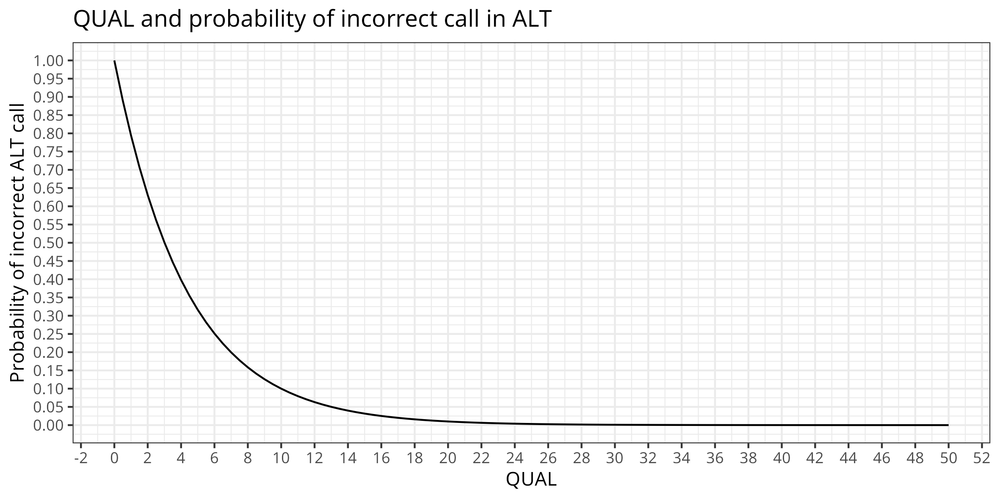
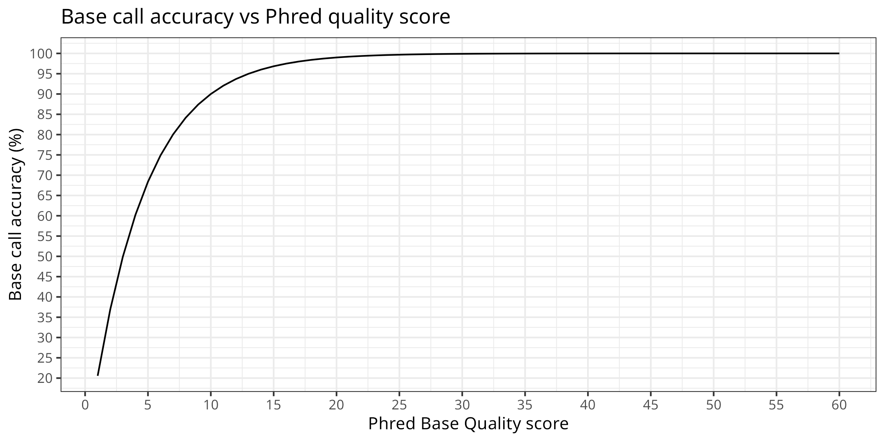
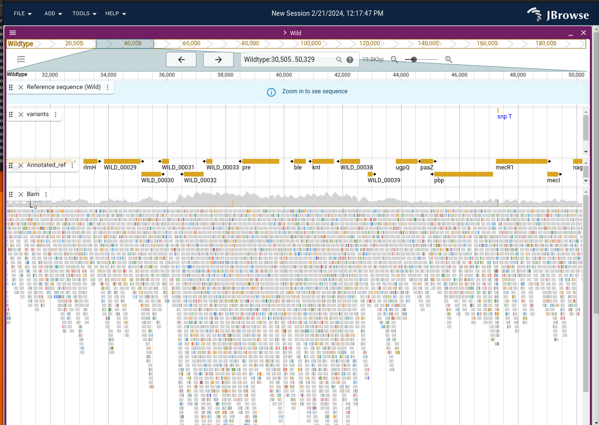

# Using [bcftools] : Utilities for variant calling and VCF (variant call format) files manipulation

## Introduction
### Background

There many variant callers, and the variants discovered differe to a certain extend between tools.

This is due to several reasons:

- data preparation:
  - sequencing depth / coverage and quality
  - accuracy and or variation during read mapping (eg. different algorithms can lead to different optimal mapping) to a reference genome[^1]
- different algorithms and criteria during variant calling and filtering

> You can read about some studies highlighting those variant calling differences. Some and non exhaustive examples:
[Hwang etal. 2015](https://www.nature.com/articles/srep17875),
[Barbitoff etal. 2022](https://bmcgenomics.biomedcentral.com/articles/10.1186/s12864-022-08365-3),
[Andreu-Sánchez etal. 2021 ](https://www.frontiersin.org/journals/genetics/articles/10.3389/fgene.2021.648229/full),
with recommendation for metagenomic samples,
[Mey Seah etal. 2023](https://journals.asm.org/doi/10.1128/jcm.01842-22) and
[Olson etal 2015](https://www.ncbi.nlm.nih.gov/pmc/articles/PMC4493402/) for microbial genomics.

Taking control of the variant calling process and how variant files are manipulated can give you control of the whole process.
It can help understanding what complex tools and pipelines actually do.
Here we will give some examples on how you can do so with bcftools.

[bcftools] utilities are assotiated or part of the [Samtools] suite of programs.
Bcftools is for example used in [Snippy] the variant calling and core genome alignment sowftware that is implemented in [ALPPACA] pipeline[^2].
Snippy do not use bcftools for variant calling[^3], but it uses it for several purposes:
filtering variants, creating consensus, converting, compressing and indexing variant files.
Bbcftools offers a variety of commands/modules to manipulate VCF files. Combining those in different way,
can help you extract the information you want from your data.

### Examples of what can you do with [bcftools] and [Samtools]

Some examples of what you can do:

- Call a consensus (using a reference and a variant call)
- Variant calling, which includes:
  - choosing between two different variant calling models : `consensus-caller` model and `multiallelic-caller` model
  - determining the likelihood of a genotype (understand of a variant in the pipelup), accounting for base and mapping quality
  - filtering variants by different criteria (eg. only calling variants that have been found in 90% of the reads of the pileup)
- Calculating copy number variation (CNV) calling
- Help ensure quality of your dataset by providing utilities to help detect sample concordance, swaps and contamination
- Detect the number of chromosomal copies (polysomy)

It can also work working with haplotypes, determine consequences of variations (eg Frame shift), and in association to specific mutation annotations (eg. as with [SnpEff]) as done in [Snippy] it can eg. help determine the effects of a mutation.

It also provide some utilities for files manipulations, and can provide statistics on variant calls, and much more. It seems eg. that it can help determining Hq variants by allowing to extract variants congruent between different variants callers (intersection).

### Ressources

There are many ressources online:

- [BCFtools HowTo, with manual](https://samtools.github.io/bcftools/howtos/index.html) and more generally [Samtools] website. A list of articles describing the algorithms and usages of [bcftools] is provided in [Samtools documentation](https://www.htslib.org/doc/#manual-pages).
- Videos on YouTube, eg. from [Bioinformatics coach channel](https://www.youtube.com/@bioinformaticscoach) <!-- TODO not sure how good they are-->

Other tutorials that are relevant:
- [Galaxy training - Microbial variant calling] with [Snippy]. **We will use the data provided in this tutorial for the exercises.** 
- [Galaxy training - Mapping]

You might have to consult the description of file formats. The standards for the following file formats can be found [here](https://samtools.github.io/hts-specs/).

- Sequence Alignment Map format (SAM)
- Variant Call Format (VCF)
- The BED format <!-- TODO is this the one used to define the intervals to analyze ?  YES -->

### Terms to become familar with
<!-- TODO Some need to be understood more-->

Computer Science:

- Binary VS non-binary variant files: BCF VS VCF - bcf is a specific form of compressed vcf. It is compressed with bgzip. 
- Working on stream - this means that one program produces an output that is then put as an input to the next without storing it as a file.
- Indexing - this is creating a lookup "cheat table" for where things are in the file. 
> Note that Some operations only work on indexed files in [bctools], and Working with multiple VCF files will require indexing.
- Standard vs non standard indexes <!-- what is that -->

An important thing to remember is that when we are working with these tools, both the reference genome and the variant file can and should be indexed. The reference genome is indexed using [samtools], while the variant file is indexed using [bcftools].

bcftools / variant manipulation:
- line interesections <!-- This is something to do with combining/cross referencing multiple variant files. We wont use that here : "when performing line intersections, the desire"  -> matching variant position ... --> 
- phasing <!-- linkage - using this information can be usefull to detect errors. We do not use here -->
- mapQ : The mapping quality - as provided by samtools. [Samtools] mapping quality is computed as such: `−10 log10 Probability {mapping position is wrong}` (phred correspondance) <!-- TODO understand better>
- BAQ: per base alignment quality - Offset to base alignment quality - realignment <!-- TODO understand better https://github.com/samtools/samtools/issues/655>

Be-aware that different aligners used mapping quality in a different way.
You can read more in [this blog](https://medium.com/@shilparaopradeep/samtools-guide-learning-how-to-filter-and-manipulate-with-sam-bam-files-2c28b25d29e8) and [here](https://www.acgt.me/blog/2014/12/16/understanding-mapq-scores-in-sam-files-does-37-42). If you use other mapping tools, you might consider how the mapQ is used to adjust parameters accordingly.
<!-- need to check if is used then in the likelihood computation - which I guess so - which means different
mapper then risk of need of adjusting quality for likelihood -->

<!-- recheck 
https://medium.com/@shilparaopradeep/samtools-guide-learning-how-to-filter-and-manipulate-with-sam-bam-files-2c28b25d29e8 
255 not available
-->

---

## Tutorial

In this tutorial we will first do variant calling using [bcftools], and then we will explore the resulting files a bit. 

### Getting the data used for this tutorial

We followed the [Galaxy training - Microbial variant calling] tutorial to provide a working data set you can exercise with. (Feel free to do the same). 
In this tutorial, [Snippy] is used to call variants between a read set and a reference genome. In this process, the reads are mapped to the reference, and the variants are subsequently called with [freebayes]. In this process, [bcftools] is used for manipulating files quite a bit. 

In this tutorial we will recreate some steps used by [Snippy] to learn how [bcftools] works.
This will also help us to better understand [Snippy]. We will eg. compare files generated with
bcftools manually to what was generated during the [Snippy] run on galaxy.

<!-- Note: I have checked: 
We get the same variant positions as presented in the tutorial.
We can eventually include the jbrowse / IGV if people want to look

Dataset : Staphylococcus aureus
1. wildtype.fna : the reference assembly. One contigs - complete , with annotations
2. mutant sample : reads mutant_R1.fastq and mutant_R2.fastq - PE - illumina
-->
The raw data and results from galaxy processing with [Snippy] for this tutorial is available in SAGA in:
`/cluster/projects/nn9305k/tutorial/20240226_bcftools/data`

And as you can see, we recovered the same variant position as in the galaxy tutorial:


### Getting started with [bcftools] in SAGA

Activate conda.
> If you havent had set conda, please look at
[Thomas tutorial](https://nvi-documentation.readthedocs.io/en/latest/tools/setting_up_conda.html)

```bash
minconda 
conda activate bcftools

bcftools --help # Version: 1.19 (using htslib 1.19.1)
# OR 
bcftools --version
```

> Note: The most recent version of VCF tools is not compatible with `samtools <= 0.1.19`.
If you need to use VCF file produced by samtool prior to this version, you will need
to convert to a more recent format.

To see the list of commands and plugins (aka what you can do with bcf tools do:)
```bash
# give you the list of default commands
bcftools 
# give you an overview of additional pluggins
bcftools plugin -lv
```

---
### Note on bcftools usage

It is possible that you will have to compress input files to be able to work with [bcftools].
We will see an example on how to do so during consensus calling.

---

### Variant calling
<!-- also did not use the quality option-->

Variant calling requires **two phases**:
- The first step is the **computation of the likelihood of each genotype** (understand the likelihood that each detected variant is true). This is done with `bcftools mpileup`. This tool will look at the bases in the bam file that have been "stacked" up on each position, and calculate the likelihood of what base should be in each position. The result file will contain both variants and non-variants.
- The second step is the actuall **call of variants**. This is done with `bcftools call`. This is a filtered and edited version of what comes out of the mpileup program, focusing on where the variants are. 

To start the process of variant calling, you need an indexed reference.
If the reference is not indexed yet, you need to create an index. This is done with samtools:
```bash
samtools faidx ../wildtype.fna
```

<!-- Ploidy encoding : we need to understand that correctly
? 0 : expected all sites no polymorphism, 1: expected haploid, 2: expected diploid.
There are options for poliploids. And how to use the ploidy eg. according to detection minor/major variants? 
Is it actually not organism ploidy per see but what is expected during the process of calling (so can be major/minor variants, ...)

https://www.biostars.org/p/318151/
Coding with respect to dosage of the minor allele e.g. If we have a biallelic loci with T and G, and say G is a minor allele, the 3 possible genotypes will be coded as follows: TT=0, TG=1, and GG = 2

Ok in VCF file: maximum ploidy among all samples that are used ! (so not of the organism)
 
DOES THIS MAKE SENSE - what are we actually calling ? See p26 of VCF  - Genotype in the field 
The organism we have is haploid. But the ploidy employed in VCF format is what is expected from variant calls. 
0: Expectation of unique bases in pileup. (Haploid, no variants - eg exact clones)
1: Expectation of one majoritary base in pileup (and 1 minor) eg. (Haploid) - for calling minor variants eg. (because you have a population of organisms) 
2: Expectation of two majority bases in pileup (eg. diploid or eg. admixture of population of haploid organisms)
different encoding ... and expectations
-->

Options used for computation of likelihood:
```bash
bcftools mplieup
```

**mplieup** options you might want to consider adjusting:
  - `-d OR --max-depth <YourDepth>` Per default the maximum depth of the pileup that is used is 250. If you have sequenced deeper, adjust this.
  - `-q, --min-MQ INT` which allows to filter out alignments that have a quality (mapQ) lower than a certain threshold
  - `-Q, --min-BQ INT` to avoid accounting for bases with a quality lower than a certain threshold
  - `-r` list OR `-R` file to select certain regions of the reference only. This can eg. allow you
to avoid calling variants in repeated regions.  <!-- TODO need eventually to find out how>
   - There are options to ajust how the likelihood is computed (we keep those for now as we have little experience, per default Illumina profile is activated)
   - `--seed INT` allows you to set the seed - this can be usefull if you try to adjust options
- Options used here:
  - `Ou`output type uncompressed
  - `f`format of fields. To do specific format for the columns of VCF file (see VCF standard FORMAT column) <!-- I assmume its defaults here as no list is provided-->

> Note that at this stage the likelihood is computed assuming a diploid organism. You will have to adjust
the filter to organism ploidy during variant calling.

Options used for variant calling:
```bash
bcftools call
```

- **call** options you might want to consider: 
  - `-r` list OR `-R` file to select certain regions of the reference only
  - options to adjust usage of the likelihood that was calculated
- used here:
  - `Oz` output type compressed (bgzf) or `Ou`output uncompressed
  - `o`output file name
  - `-c` OR `-m` is the variant calling model chosen (pick one).
  - `v` output variant sites only (this is what is a VCF)
  - `--ploidy` <!-- TODO understand that better -->

Note:
> `-c` _consensus-caller_ model is the originally developped model, while
`-m`, the _multiallelic-caller_ which is used for rare-variants and multiallelic calling is NOW the default method used in bcfools.


Tutorial:
```bash
cd tutorial
# bcftools mpileup -Ou -f <ref.fasta> <mapped_reads.bam>  "the result of this is piped to:"
# bcftools call -mv -Oz -o <called_variants>.vcf.gz
bcftools mpileup -Ou --max-depth 500  -f ../wildtype.fna ../galaxy_snippy/snippy.bam  -Ou -o result_mpileup.vcf
bcftools call -mv -Ou --ploidy 1 -o calls.vcf result_mpileup.vcf

# OR in one command 
bcftools mpileup -Ou  --max-depth 500 -f ../wildtype.fna ../galaxy_snippy/snippy.bam | bcftools call -mv -Ou --ploidy 1 -o calls.vcf
```
Have a look at both the vcf files that are produced here. To make it easier, use `ls -S filename`. As you can see you have a lot of things in the file produced first, and much less in the second.

Find which VCF file format is used and look at the [corresponding format standard](https://samtools.github.io/hts-specs/)
<!-- TODO POKING KARIN-->


### Inspiration: what does [Snippy] uses [bcftools] for ?

You can have a look at the commands used by [Snippy] 
in the tutorial data`/cluster/projects/nn9305k/tutorial/20240226_bcftools/` subfolder `data/galaxy_snippy/snippy.txt` file.

#### Consensus calling

[Snippy] uses this command[^5] to create the consensus sequence
`bcftools consensus --sample mutant_R1_fastq -f reference/ref.fa -o snps.consensus.fa snps.vcf.gz` 

`-o`is the consensus output file - fasta format
`snps.vcf.gz` is the compressed form of the final and annotated variant file 
`ref.fa`is the wild strain reference (it only differs by encoding in upper vs lower cases)
`mutant_R1_fastq` is the sample name

<!-- ? can we try to recreate -> yes working ! -->

1. We create a copy of the VCF file and reference in a separate directory to be able to follow our work
2. We need to index and compress the VCF file (bgzip). The compressing utility is installed with samtools/bctools
3. We recreate the consensus
4. We compare our consensus to Snippy consensus.
Because in theory those sequences should be identical (obtained by the same means, but it might have been some headers reformating), we can concatenate "our" consensus and Snippy consensus and pretend this is an alingnment and detect SNPs differences between those consensus files. 

Note: We used the final files provided by galaxy to demonstrate equivalence

```bash
# 1. Create dir, copy of the VCF and ref files
cd data && mkdir consensus && cd consensus 
cp ../galaxy_snippy/snippy.vcf .
cp ../wildtype.fna .
ls

# 2. Compress and index the VCF file 
conda activate bcftools
bgzip -ik snippy.vcf 
# there is a problem with the index that is given as output (bug) we fix that 
bcftools index snippy.vcf.gz
# Creating the consensus
bcftools consensus --samples mutant_R1_fastq --fasta-ref wildtype.fna --output our_consensus.fasta snippy.vcf.gz
conda deactivate

# Comparison to snippy consensus
# In theory those sequences should be identical (except maybe header) 
# create a dummy alignment
cd ..
cat galaxy_snippy/snippy_consensus.fasta consensus/our_consensus.fasta > dummy.fasta

conda activate snp-dists
snp-dists -a dummy.fasta # no differences were detected
conda deactivate
```
#### Variant filtering

Why filter variants, an example of variants being filtered out because of lack of depth in the pileup.


The unfiltered variants called with [FreeBayes] when running [Snippy] can be found here:
`data/galaxy_snippy/snippy_zip/mutant_R1_fastq/snps.raw.vcf` 
and the filtered variant call here `data/galaxy_snippy/snippy_zip/mutant_R1_fastq/snps.filt.vcf`.

---
Note: The final annotated variant[^4] are provided in `data/galaxy_snippy/snippy_zip/mutant_R1_fastq/snps.vcf`.
> Note: This last one is equivalent to the one exported as `data/galaxy_snippy/snippy.vcf`.
> You can test this using `diff file1 file 2`
```bash
cd data
diff galaxy_snippy/snippy_zip/mutant_R1_fastq/snps.vcf galaxy_snippy/snippy.vcf 
```

---
We need to understand also to look at the unfiltered variant and find which VCF format was used, and gain information about the meaning of the fields. We need also to compare this file with the filtered variant file, and understand what is done in [Snippy].

```bash 
cd data/snippy/mutant_R1_fastq
less snps.raw.vcf
```

1. Which VCF version was used ?
   1. The [VCF file standard used is VCFv4.2](https://samtools.github.io/hts-specs/VCFv4.2.pdf). Bellow an extract of the relevant fields.
2. Which reference was used, its ID and length
3. You can see the command that was called to call [FreeBayes].
4. That no phasing information was used.
5. The fields descriptions for the columns provided in the VCF file

**Description of metadata content in the VCF file**

- INFO : description of the fields
- FORMAT/TAG = FMT/TAG <!-- TAG is the flag used to describe what type of info is contained>
- FILTER : Description of the filters that have been applied to the data

**VCF fields**

- CHROM : contig / chromosome of the reference
- POS : position according to the reference (base 1)
- ID : type of structural variant <!-- no structural variant so . >
- REF : the nucleotide in the reference
- ALT : the alternate nucleotide(s) in the sample (comma separated)
- QUAL : Phred-scaled quality score for the assertion made in ALT. "−10log10 prob(call in ALT is
wrong)".

FILTER : filter status : PASS if go through all the filters, otherwise list of filters where it failed <!-- no filter>

`INFO`: Additional information for the variants detected (see descriptions of tags). We can look at some of those
<!-- AB	ABP	AC	AF	AN	AO	CIGAR	DP	DPB	DPRA	EPP	EPPR	GTI	LEN	MEANALT	MQM	MQMR 	NS	NUMALT	ODDS 	PAIRED	PAIREDR	PAO	PQA	PQR	PRO	QA	QR	RO	RPL	RPP	RPPR	RPR	RUN	SAF	SAP	SAR	SRF	SRP	SRR-->

- AC: allele count in genotypes <!-- as considered as diploid 2 are counted when not filtered -->
- AF: allele frequency (in order allele is listed)
- AN: total number of alleles in called alleles
- DP: combined depth across samples at the position (eg. here we used one sample so it gives the depth)
- LEN: the allele length
- TYPE:  describe the type of variant (snp, del, ins, mnp: several bases changes)
... 
Some information can be redundant with format

FORMAT : **read specific to vcf file you have, some abbreviations may change**

- GT : genotype encoded (diploid ./. haploid . - / means unphased otherwise would be | )
- DP : here its the read depth
- AD : number of observations for each allele
- RO : reference allele observation count
- QR : Sum of quality of the reference observations
- QA : Sum of quality of the alternate observations
- AO : Alternate allele observation count"
- GL : genotype likelihod (ref, diploid - 1 for each allele)



<!-- Given the values are provided correctly by the correct program and in raw given in diploid ? -->



**Looking at [Snippy] very long filtering command ...**
> Note that snippy uses an earlier version of bcftools, this is why the command is sligly different than the command used in our tutorial
```bash
bcftools view --include 'FMT/GT="1/1" && QUAL>=100.0 && FMT/DP>=10 && (FMT/AO)/(FMT/DP)>=0.9' snps.raw.vcf  | vt normalize -r reference/ref.fa - | bcftools annotate --remove '^INFO/TYPE,^INFO/DP,^INFO/RO,^INFO/AO,^INFO/AB,^FORMAT/GT,^FORMAT/DP,^FORMAT/RO,^FORMAT/AO,^FORMAT/QR,^FORMAT/QA,^FORMAT/GL' > snps.filt.vcf
```

- [Snippy] uses advanced variant filtering options: [bcftools] `--include`and `exclude`. 

Lets decompose : 1 -> 2 -> 3 -> 4
1. `bcftools view --include 'FMT/GT="1/1" && QUAL>=100.0 && FMT/DP>=10 && (FMT/AO)/(FMT/DP)>=0.9' snps.raw.vcf`
   1. `view` allows to view, filter and subset VCF
   2. GT=1/1 Genotype must be identical (homozygosity) : here is the transfromation from the diploid encoding so it gets valid with halpoids
   3. QUAL>=100 guet as close as possible as 0 probability incorect ALT call (adjust not to filter all!)
   4. FMT/DP>=10 : Filtering if depth at locus is < 10
   5. (FMT/AO)/(FMT/DP)>=0.9 - AC >= 0.9 read depth to be acounted for
2. `vt normalize -r reference/ref.fa` - [Snippy] use [vt] tool to do an operation called **[variant normalisation](https://genome.sph.umich.edu/wiki/Variant_Normalization)**, which standardize the way variants are represented in the VCF file.
<!-- POKING KARIN
- Different optimal local alignments for variants can be equal, however those need to be represented in a consistent maner to allow reproducibility and eg. combining different variant files. This allows to standardise the representation of variants and will allow comparison of variant representation. 
- TODO read with fresh head
-->  
1. `bcftools annotate --remove '^INFO/TYPE,^INFO/DP,^INFO/RO,^INFO/AO,^INFO/AB,^FORMAT/GT,^FORMAT/DP,^FORMAT/RO,^FORMAT/AO,^FORMAT/QR,^FORMAT/QA,^FORMAT/GL'`
   1. `annotate` allows to add or remove annotation to VCF files. So its a way to slighly clean the long VCF file from the fields the author does not want to keep.
2. output the filtered variants to file: `> snps.filt.vcf`

**Can we reproduce this type of filtering?**

```bash
# copy input in 
mkdir filter_variants && cf filter_variants
bcftools view --include 'FMT/GT="1/1" && QUAL>=100.0 && FMT/DP>=10 && (FMT/AO)/(FMT/DP)>=0.9' -Ou -o filter_step1.vcf snps.raw.vcf 
```

Line in VCF are added to show the filtering column, and we can crosscheck that the variants are filtered according to those criteria, we can see in the vcf file that the loci that did not fullfill criteria are filtered out

<!-- Normalisation https://www.biostars.org/p/359264/ -->
The normalisation of bcftools appear to be slighly different than the one from [vt] tool. [bcftools] seems to only left align, whereas [vt] tool appear to apply an additional parsiomny criteria. <!-- not sure makes difference for the present dataset-->
> There are also options to split or combine multiallelic sites (VCF manipulation). 
To do a simple left alignment, one can do:

```bash
bcftools norm -f wildtype.fna -Ou -o filter_step2.vcf filter_step1.vcf 
```

And then we can filter the fields in the vcf file
```bash
bcftools annotate --remove '^INFO/TYPE,^INFO/DP,^INFO/RO,^INFO/AO,^INFO/AB,^FORMAT/GT,^FORMAT/DP,^FORMAT/RO,^FORMAT/AO,^FORMAT/QR,^FORMAT/QA,^FORMAT/GL' -Ou -o filter_step3.vcf filter_step2.vcf
```
This also add the last command to the VCF file.

Check difference between filtered variant file and our results. The same variants remain.
However we do not have the effect annotations yet.

# HERE Continue prep.
#### Variant Annotation

[Snippy] uses [SnpEff] to annotate variant and their possible effects. 

The command used are:
```bash 
snpEff build -c reference/snpeff.config -dataDir . -gff3 ref
# With a nice warning: WARNING: All frames are zero! This seems rather odd, please check that 'frame' information in your 'genes' file is accurate.
snpEff ann -noLog -noStats -no-downstream -no-upstream -no-utr -c reference/snpeff.config -dataDir . ref snps.filt.vcf > snps.vcf
# /usr/local/bin/snippy-vcf_to_tab --gff reference/ref.gff --ref reference/ref.fa --vcf snps.vcf > snps.tab # This is a reformating to make it easier to read 
```

### CNV copy number variation

Possible copy number variation: 


# END

<!-- Should add Snippy also has some regions filters I think - I did not look at that yet>

<!-- Footnotes -->

[^1]: Mapping to an external or assembly from the reads you are using to call variants

[^2]: Analysis with [Snippy] is implemented in the _mapping analysis_ track in [ALPPACA]

[^3]: [Snippy] uses [FreeBayes](https://github.com/freebayes/freebayes) as variant caller.

[^4]: Filtered variants are annotated with [SnpEff]

[^5]: Probably earlier version of [bcftools]

<!--References -->

[Galaxy training - Mapping]:https://training.galaxyproject.org/training-material/topics/sequence-analysis/tutorials/mapping/tutorial.html

[Galaxy training - Microbial variant calling]:https://training.galaxyproject.org/training-material/topics/variant-analysis/tutorials/microbial-variants/tutorial.html

[bcftools]:https://samtools.github.io/bcftools/bcftools.html

[Samtools]:https://www.htslib.org/

[Snippy]: https://github.com/tseemann/snippy

[ALPPACA]:https://github.com/NorwegianVeterinaryInstitute/ALPPACA/tree/master

[FreeBayes]:https://github.com/freebayes/freebayes

[SnpEff]:https://pcingola.github.io/SnpEff/

[vt]:https://genome.sph.umich.edu/wiki/Vt

<!-- Coordinates of interest in our dataset:

29,439..29,515 The one in tutorial
47299 - other one suggested in tutorial
102660 - a low zone coverage that needs to be filtered out 
102968 - 103048 - zone with 2 variants  
[138877-138954] - 2 variants + 1 filtered out because not enough coverage
103378 deletion , 114540
106602 variant - 109833, 129881
106722 insertion

There is a whole section missing the mutated before 165204 
Not sure what we could use for the gene coverage ... maybe we need another example or just gamble

Possible region with duplicates : 36434 - 38778
-->

<!-- 
https://www.htslib.org/doc/samtools.html 

How a guide here ! https://medium.com/@shilparaopradeep/samtools-guide-learning-how-to-filter-and-manipulate-with-sam-bam-files-2c28b25d29e8

Fix index possibilities
 zcat snippy.vcf.gz | bgzip -c > snippy.new.vcf.gz && tabix snippy.new.vcf.gz
--> 


>
