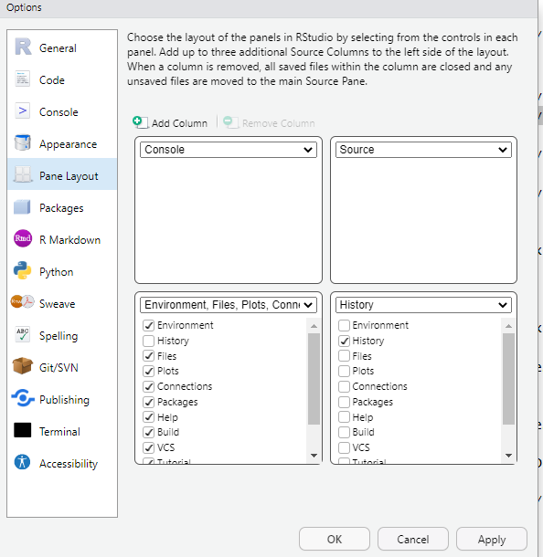

# Tips for working in RStudio

- **Author:** Novica Nakov

## Overview

This is a guide on how to do different things in RStudio to make your work easier and simpler. Some of it is good practices, some of it is just my preferences, but it may be useful for other people too.

### RStudio settings

Under the menu "Tools" > "Global Options" > "General" > "Basic":

The `R session` section should be set to restore only opened source documents. This is because sometimes you can be drafting a code and forget to save it. It may be useful, or it may be not useful. But it is a good way to see what was going on.

The `Workspace` section, set it up to not restore or save `.Rdata`. This is because it is good to have an empty environment when you start RStudio.

Under the "Tools menu" > "Global Options" > "Code" > "Editing":

Check to use the native pipe operator `|>`. This is because most of the time you don't need the `magrittr` pipe `%>%`, and/or maybe you don't want to load a package just to have the pipe available. There is some difference how the two pipes behave, just to be aware of it:

```
❯ iris %>% head()
  Sepal.Length Sepal.Width Petal.Length Petal.Width Species
1          5.1         3.5          1.4         0.2  setosa
2          4.9         3.0          1.4         0.2  setosa
3          4.7         3.2          1.3         0.2  setosa
4          4.6         3.1          1.5         0.2  setosa
5          5.0         3.6          1.4         0.2  setosa
6          5.4         3.9          1.7         0.4  setosa

❯ iris %>% head
  Sepal.Length Sepal.Width Petal.Length Petal.Width Species
1          5.1         3.5          1.4         0.2  setosa
2          4.9         3.0          1.4         0.2  setosa
3          4.7         3.2          1.3         0.2  setosa
4          4.6         3.1          1.5         0.2  setosa
5          5.0         3.6          1.4         0.2  setosa
6          5.4         3.9          1.7         0.4  setosa


❯ iris |> head()
  Sepal.Length Sepal.Width Petal.Length Petal.Width Species
1          5.1         3.5          1.4         0.2  setosa
2          4.9         3.0          1.4         0.2  setosa
3          4.7         3.2          1.3         0.2  setosa
4          4.6         3.1          1.5         0.2  setosa
5          5.0         3.6          1.4         0.2  setosa
6          5.4         3.9          1.7         0.4  setosa

❯ iris |> head
Error in head : 
  The pipe operator requires a function call as RHS (<input>:1:9)
```

The shortcut to type the pipe is always useful regardless of which pipe you are using: `Ctrl+Shift+M`.

Under the menu "Tools" > "Global Options" > "Code" > "Display":

Check `Highlight R function calls`. Great to be able to see which part of your code is actually a function name.

Check `Use rainbow parentheses`. Great to be abel to see the matching parentheses especially in long chunks of code and in Shiny.

Check `Show margin and set at 80 characters`. This will show a vertical line in the code to help you keep readability in mind when writing long lines of code or comments.

### RStudio Workspace Panes

The default settings for the Workspace Panes in Rstudio has the code editor on the left side. 

A good improvement on that is to have the editor on the right side of the workspace and the console/terminal on the left. The bottom pane on the right side should keep just the history tab, whereas all the other tabs go in the bottom left pane. That way, you can expand the code editing pane to the whole right side of the screen without sacrificing too much functionality. You don't need to check the code history tab too much when working, if at all.

To set this up go to "Tools" > "Pane Layout". It should look like this:



This is also focus your vision to the center of the screen as most typing in the code editing panel will happen in the centre of the sceen within the 80 character margin.